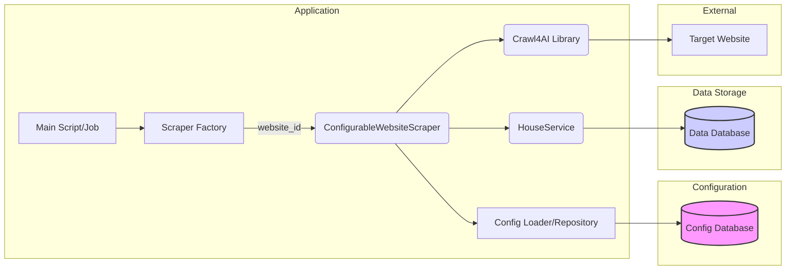
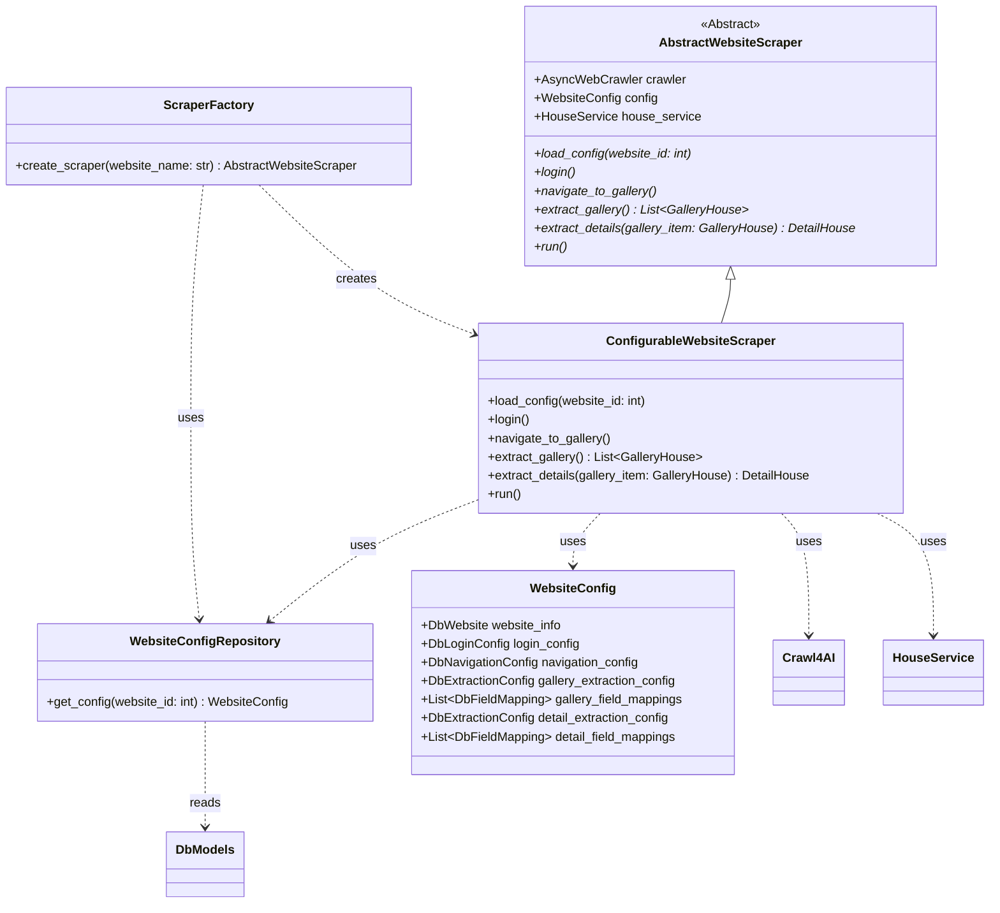

## Implementatieplan: Generieke Scrapingstructuur voor Woningwebsites

**Doel:** Refactor de bestaande Python scraping-applicatie om een flexibele, configureerbare en uitbreidbare architectuur te creëren die meerdere woningwebsites kan ondersteunen met minimale code-aanpassingen.

**Kernprincipes:**

1.  **Configuration over Code:** Website-specifieke details (selectors, URLs, logica) worden opgeslagen in een database en dynamisch geladen.
2.  **Abstraction:** Gebruik abstracte klassen om de kern-scrapingflow te definiëren.
3.  **Modularity:** Splits het proces op in logische, herbruikbare componenten (Login, Navigatie, Extractie).
4.  **Extensibility (Open/Closed Principle):** Nieuwe websites toevoegen door configuratie (en eventueel een nieuwe concrete klasse) toe te voegen, zonder de kernlogica aan te passen.
5.  **Maintainability:** Gebruik type hints, SOLID-principes en duidelijke naamgeving.

---

### 1. Overzicht van de Architectuur

De nieuwe architectuur bestaat uit de volgende hoofdcomponenten:

1.  **Configuratie Database:** Een PostgreSQL-database (zoals nu gebruikt) met tabellen die de specifieke configuratie voor elke ondersteunde website bevatten.
2.  **Configuratie Lader:** Een component (bv. een `ConfigRepository`) verantwoordelijk voor het laden van de website-specifieke configuratie uit de database.
3.  **Abstracte Scraper (`AbstractWebsiteScraper`):** Definieert de interface en de algemene stappen van het scrapingproces (login, navigeren, extraheren).
4.  **Concrete Scraper (`ConfigurableWebsiteScraper`):** Een implementatie van `AbstractWebsiteScraper` die de configuratie gebruikt om de scrapingstappen uit te voeren. Deze klasse zal voor de meeste websites volstaan.
5.  **Scraper Factory:** Een mechanisme om de juiste scraper-instantie (meestal `ConfigurableWebsiteScraper`) te creëren op basis van een website-ID of naam.
6.  **Core Scraping Library (`crawl4ai`):** Wordt gebruikt door de concrete scraper voor browserautomatisering en basis-extractie.
7.  **Data Models (Pydantic):** Definiëren de structuur van de gescrapete data (`GalleryHouse`, `DetailHouse`). Deze blijven grotendeels zoals ze zijn.
8.  **Database Models (SQLAlchemy):** Definiëren de structuur van de opgeslagen data en configuratie.
9.  **Service Layer (`HouseService`):** Blijft verantwoordelijk voor de interactie met de data-opslag (repositories).



---

### 2. Gedetailleerd Databaseontwerp (Configuratie Schema)

We voegen nieuwe tabellen toe aan de `steal_house` schema voor de configuratie.

**Nieuwe Tabellen:**

1.  **`websites`**
    *   `id`: `SERIAL PRIMARY KEY`
    *   `name`: `VARCHAR(100) NOT NULL UNIQUE` (bv. 'Vesteda', 'Pararius')
    *   `base_url`: `VARCHAR(255) NOT NULL` (bv. 'https://hurenbij.vesteda.com')
    *   `is_active`: `BOOLEAN DEFAULT TRUE` (Om sites aan/uit te zetten)
    *   `description`: `TEXT NULLABLE`
    *   `created_at`: `TIMESTAMP DEFAULT CURRENT_TIMESTAMP`
    *   `updated_at`: `TIMESTAMP DEFAULT CURRENT_TIMESTAMP`

2.  **`login_configs`**
    *   `id`: `SERIAL PRIMARY KEY`
    *   `website_id`: `INTEGER NOT NULL REFERENCES websites(id) ON DELETE CASCADE`
    *   `login_url_path`: `VARCHAR(255) NULLABLE` (Relatief pad, bv. '/login/')
    *   `username_selector`: `VARCHAR(255) NOT NULL` (CSS/XPath selector)
    *   `password_selector`: `VARCHAR(255) NOT NULL`
    *   `submit_selector`: `VARCHAR(255) NOT NULL`
    *   `success_indicator_selector`: `VARCHAR(255) NULLABLE` (Element dat verschijnt na succesvolle login)
    *   `needs_login`: `BOOLEAN DEFAULT TRUE`
    *   `credential_source`: `VARCHAR(100) NOT NULL` (bv. 'env:VESTEDA_EMAIL', 'env:VESTEDA_PASSWORD' - geeft aan welke env vars te gebruiken)
    *   `created_at`: `TIMESTAMP DEFAULT CURRENT_TIMESTAMP`
    *   `updated_at`: `TIMESTAMP DEFAULT CURRENT_TIMESTAMP`

3.  **`navigation_configs`**
    *   `id`: `SERIAL PRIMARY KEY`
    *   `website_id`: `INTEGER NOT NULL REFERENCES websites(id) ON DELETE CASCADE`
    *   `gallery_url_path`: `VARCHAR(255) NOT NULL` (Relatief pad naar de startpagina van de galerij)
    *   `steps`: `JSONB NULLABLE` (Optionele reeks stappen om naar de galerij te navigeren na login of vanaf base\_url, bv. `[{"action": "click", "selector": "#button1"}, {"action": "wait", "selector": ".results", "timeout": 5000}]`)
    *   `next_page_selector`: `VARCHAR(255) NULLABLE` (Selector voor de 'volgende pagina' knop/link in de galerij)
    *   `created_at`: `TIMESTAMP DEFAULT CURRENT_TIMESTAMP`
    *   `updated_at`: `TIMESTAMP DEFAULT CURRENT_TIMESTAMP`

4.  **`extraction_configs`** (Generieke tabel voor velddefinities)
    *   `id`: `SERIAL PRIMARY KEY`
    *   `website_id`: `INTEGER NOT NULL REFERENCES websites(id) ON DELETE CASCADE`
    *   `scope`: `VARCHAR(50) NOT NULL` ('gallery' of 'detail')
    *   `base_selector`: `VARCHAR(255) NOT NULL` (Selector voor het herhalende element, bv. `div.property-card` of leeg voor detailpagina)
    *   `created_at`: `TIMESTAMP DEFAULT CURRENT_TIMESTAMP`
    *   `updated_at`: `TIMESTAMP DEFAULT CURRENT_TIMESTAMP`
    *   `UNIQUE (website_id, scope)`

5.  **`field_mappings`** (Definieert hoe Pydantic velden worden geëxtraheerd)
    *   `id`: `SERIAL PRIMARY KEY`
    *   `extraction_config_id`: `INTEGER NOT NULL REFERENCES extraction_configs(id) ON DELETE CASCADE`
    *   `pydantic_field_name`: `VARCHAR(100) NOT NULL` (Naam van het veld in `GalleryHouse` of `DetailHouse`, bv. 'address', 'rental_price')
    *   `selector`: `VARCHAR(255) NOT NULL` (CSS/XPath selector relatief aan `base_selector`)
    *   `selector_type`: `VARCHAR(10) DEFAULT 'css'` ('css' of 'xpath')
    *   `extraction_type`: `VARCHAR(20) DEFAULT 'text'` ('text', 'attribute', 'html')
    *   `attribute_name`: `VARCHAR(50) NULLABLE` (Indien `extraction_type` 'attribute' is, bv. 'href', 'src')
    *   `is_required`: `BOOLEAN DEFAULT FALSE`
    *   `default_value`: `VARCHAR(255) NULLABLE`
    *   `created_at`: `TIMESTAMP DEFAULT CURRENT_TIMESTAMP`
    *   `updated_at`: `TIMESTAMP DEFAULT CURRENT_TIMESTAMP`

**Relaties:**

*   `websites` 1 : 1 `login_configs`
*   `websites` 1 : 1 `navigation_configs`
*   `websites` 1 : N `extraction_configs` (één voor 'gallery', één voor 'detail')
*   `extraction_configs` 1 : N `field_mappings`

**SQLAlchemy Modellen:** Definieer corresponderende SQLAlchemy modellen (bv. `DbWebsite`, `DbLoginConfig`, etc.) in `crawler_job/models/config_models.py`.

**Alembic Migraties:** Genereer nieuwe Alembic migratiescripts om deze tabellen aan te maken.

---

### 3. Architectuurplan voor de Scrapingklassen

**Klassendiagram (Conceptueel):**



**Klasse Beschrijvingen:**

1.  **`WebsiteConfig` (Data Class / Pydantic Model):**
    *   Houdt de geladen configuratie voor één website vast.
    *   Bevat attributen voor `DbWebsite`, `DbLoginConfig`, `DbNavigationConfig`, `DbExtractionConfig` (gallery/detail), en lijsten van `DbFieldMapping` (gallery/detail).

2.  **`WebsiteConfigRepository`:**
    *   **Verantwoordelijkheid:** Haalt configuratiedata uit de database voor een gegeven `website_id`.
    *   **Methoden:**
        *   `__init__(self, session: AsyncSession)`
        *   `async get_config(self, website_id: int) -> WebsiteConfig`: Laadt alle gerelateerde configuraties en retourneert een `WebsiteConfig` object.

3.  **`AbstractWebsiteScraper`:**
    *   **Verantwoordelijkheid:** Definieert het contract en de hoofdstructuur voor alle website scrapers.
    *   **Attributen:**
        *   `crawler: AsyncWebCrawler` (gedeelde crawl4ai instantie)
        *   `config: Optional[WebsiteConfig]` (geladen configuratie)
        *   `house_service: HouseService` (voor data opslag)
        *   `config_repo: WebsiteConfigRepository`
        *   `session_id: str` (unieke sessie ID voor crawl4ai)
    *   **Methoden:**
        *   `__init__(self, crawler: AsyncWebCrawler, house_service: HouseService, config_repo: WebsiteConfigRepository)`
        *   `async load_config(self, website_id: int) -> None`: Abstracte methode om configuratie te laden.
        *   `async login(self) -> bool`: Abstracte methode voor inloggen. Retourneert `True` bij succes.
        *   `async navigate_to_gallery(self) -> str`: Abstracte methode om naar de galerij te navigeren. Retourneert de URL van de galerijpagina.
        *   `async extract_gallery(self) -> List[GalleryHouse]`: Abstracte methode om galerij-items te extraheren.
        *   `async extract_details(self, gallery_item: GalleryHouse) -> Optional[DetailHouse]`: Abstracte methode om details van één woning te extraheren.
        *   `async run(self, website_id: int) -> Dict[str, Any]`: Abstracte methode die de volledige scrape-flow orkestreert.

4.  **`ConfigurableWebsiteScraper`:**
    *   **Verantwoordelijkheid:** Implementeert de `AbstractWebsiteScraper` methoden op basis van de geladen `WebsiteConfig`.
    *   **Methoden:**
        *   Implementeert alle abstracte methoden.
        *   `login()`: Gebruikt `config.login_config` en `crawl4ai` om in te loggen. Haalt credentials uit env vars zoals gespecificeerd in `credential_source`.
        *   `navigate_to_gallery()`: Gebruikt `config.navigation_config.gallery_url_path` en voert eventuele `steps` uit met `crawl4ai`.
        *   `extract_gallery()`: Gebruikt `config.gallery_extraction_config` en `config.gallery_field_mappings`. Iterateert over elementen gevonden met `base_selector` en past `field_mappings` toe met een helper functie (`_apply_field_mappings`). Gebruikt `crawl4ai`'s `JsonCssExtractionStrategy` of een vergelijkbare interne logica. Pagineert indien `next_page_selector` aanwezig is.
        *   `extract_details()`: Navigeert naar `gallery_item.detail_url`. Gebruikt `config.detail_extraction_config` en `config.detail_field_mappings` om data te extraheren met `_apply_field_mappings`.
        *   `run()`: Orkestreert de flow: `load_config`, `login` (indien nodig), `navigate_to_gallery`, `extract_gallery`, loop over items -> `extract_details`, `house_service.store_houses_atomic`.
        *   `_apply_field_mappings(self, element: Any, mappings: List[DbFieldMapping]) -> Dict[str, Any]`: Private helper om veldmappings toe te passen op een Playwright element of BeautifulSoup tag.

5.  **`ScraperFactory`:**
    *   **Verantwoordelijkheid:** Creëert de juiste scraper instantie.
    *   **Methoden:**
        *   `__init__(self, crawler: AsyncWebCrawler, house_service: HouseService, config_repo: WebsiteConfigRepository)`
        *   `async create_scraper(self, website_name: str) -> AbstractWebsiteScraper`: Zoekt website ID op basis van naam, laadt config, en instantieert (meestal) `ConfigurableWebsiteScraper`. Kan later worden uitgebreid om specifieke klassen te kiezen voor uitzonderlijke websites.

---

### 4. Extensibiliteitsplan

1.  **Nieuwe Website Toevoegen (Standaard Flow):**
    *   Voeg een nieuwe rij toe aan de `websites` tabel.
    *   Voeg corresponderende rijen toe aan `login_configs`, `navigation_configs`, `extraction_configs` (voor gallery en detail), en `field_mappings` met de juiste selectors en configuraties voor de nieuwe site.
    *   De `ScraperFactory` zal automatisch de `ConfigurableWebsiteScraper` gebruiken met de nieuwe configuratie. Er zijn geen code-aanpassingen nodig in de scraper zelf.

2.  **Website met Afwijkende Structuur:**
    *   **Scenario 1: Kleine afwijking (bv. andere login flow):** Overweeg de configuratie flexibeler te maken (bv. meer opties in `login_configs` of `navigation_configs.steps`).
    *   **Scenario 2: Grote afwijking (bv. API-based, complexe JS interactie):**
        *   Creëer een nieuwe klasse, bv. `SpecialSiteScraper`, die erft van `AbstractWebsiteScraper`.
        *   Override alleen de methoden die afwijken (bv. `extract_gallery` als de site een API gebruikt). Implementeer de specifieke logica daar.
        *   Pas de `ScraperFactory` aan om `SpecialSiteScraper` te retourneren voor die specifieke `website_name`.
        ```python
        # Example in ScraperFactory
        async def create_scraper(self, website_name: str) -> AbstractWebsiteScraper:
            website_id = await self.config_repo.get_website_id_by_name(website_name)
            if not website_id:
                raise ValueError(f"Website '{website_name}' not found in config.")

            if website_name == 'SpecialSite':
                scraper = SpecialSiteScraper(self.crawler, self.house_service, self.config_repo)
            else:
                # Default case
                scraper = ConfigurableWebsiteScraper(self.crawler, self.house_service, self.config_repo)

            await scraper.load_config(website_id)
            return scraper
        ```
    *   Dit volgt het Open/Closed Principle: de kern is gesloten voor modificatie, maar open voor extensie via nieuwe klassen.

---

### 5. Stappenplan voor Implementatie

1.  **Database Modellen & Migraties:**
    *   Definieer SQLAlchemy modellen voor de nieuwe configuratietabellen (`DbWebsite`, `DbLoginConfig`, etc.) in `crawler_job/models/config_models.py`.
    *   Genereer en pas Alembic migraties toe om het schema te creëren (`alembic revision --autogenerate -m "add_website_config_tables"`, `alembic upgrade head`).
2.  **Configuratie Laden:**
    *   Implementeer `WebsiteConfigRepository` in `crawler_job/services/repositories/config_repository.py`.
    *   Implementeer de `get_config` methode om alle gerelateerde configuraties te laden.
    *   Definieer de `WebsiteConfig` Pydantic/dataclass.
3.  **Abstracte Scraper:**
    *   Definieer `AbstractWebsiteScraper` met de abstracte methoden in `crawler_job/crawlers/base_scraper.py`.
4.  **Concrete Scraper:**
    *   Implementeer `ConfigurableWebsiteScraper` in `crawler_job/crawlers/configurable_scraper.py`.
    *   Implementeer de `load_config` methode.
    *   Implementeer de `login`, `navigate_to_gallery`, `extract_gallery`, `extract_details` methoden, gebruikmakend van de geladen `self.config` en `self.crawler` (crawl4ai).
    *   Implementeer de `_apply_field_mappings` helper functie.
    *   Implementeer de `run` methode die de flow orkestreert.
5.  **Factory:**
    *   Implementeer `ScraperFactory` in `crawler_job/crawlers/scraper_factory.py`.
6.  **Integratie:**
    *   Pas het hoofdscript (bv. `vesteda_crawler.py` of een nieuw `main.py`) aan:
        *   Initialiseer `AsyncWebCrawler`, `HouseService`, `WebsiteConfigRepository`.
        *   Initialiseer `ScraperFactory`.
        *   Gebruik de factory om een scraper te maken voor een specifieke website (bv. 'Vesteda').
        *   Roep `scraper.run(website_id)` aan.
7.  **Configuratie Vullen:**
    *   Vul de database met de configuratie voor Vesteda als eerste testcase. Haal de selectors en URLs uit de bestaande `vesteda_steps` code.
8.  **Refactor Vesteda:**
    *   Verwijder de hardcoded logica uit `vesteda_steps` die nu door de `ConfigurableWebsiteScraper` wordt afgehandeld op basis van configuratie. De `vesteda_steps` kunnen mogelijk volledig verdwijnen of worden gereduceerd tot zeer specifieke helper functies als die nodig blijven.
9.  **Testen:**
    *   Unit tests voor `WebsiteConfigRepository`.
    *   Integratietests voor `ConfigurableWebsiteScraper` met mock configuratie en mock `crawl4ai` responses.
    *   End-to-end test voor Vesteda met de nieuwe structuur.
10. **Documentatie:**
    *   Update `README.md` en `architecture.md`.
    *   Documenteer hoe nieuwe websites geconfigureerd moeten worden.

---

### 6. Potentiële Uitdagingen en Aanpak

1.  **Complexe Navigatie/Interactie:**
    *   **Uitdaging:** Websites vereisen soms meerdere klikken, formulierinvullingen, of wachten op dynamische elementen voordat de galerij zichtbaar is.
    *   **Aanpak:** Gebruik het `navigation_configs.steps` JSONB veld om een reeks acties (`click`, `wait`, `fill`, `scroll`) met bijbehorende selectors en waarden te definiëren. De `ConfigurableWebsiteScraper` parseert en voert deze stappen sequentieel uit met `crawl4ai`.
2.  **Variërende Detailpagina Structuren:**
    *   **Uitdaging:** Niet alle sites hebben dezelfde detailvelden (bv. 'service costs', 'neighborhood').
    *   **Aanpak:** Maak velden in `DetailHouse` Pydantic model `Optional`. Markeer velden in `field_mappings` als `is_required=False` en geef eventueel een `default_value`. De `_apply_field_mappings` helper moet hier rekening mee houden.
3.  **Anti-Scraping Maatregelen:**
    *   **Uitdaging:** CAPTCHAs, IP-blokkades, dynamisch veranderende selectors.
    *   **Aanpak:**
        *   Gebruik `crawl4ai`'s anti-bot features (`magic`, `simulate_user`).
        *   Integreer proxy rotatie (configureerbaar via `BrowserConfig`).
        *   Implementeer rate limiting en respecteer `robots.txt` (via `CrawlerRunConfig`).
        *   Voor CAPTCHAs: overweeg integratie met externe oplosdiensten (complex, mogelijk buiten scope initieel).
        *   Voor veranderende selectors: Regelmatige controle en update van de configuratie in de database is nodig.
4.  **LLM-gebaseerde Extractie:**
    *   **Uitdaging:** Sommige data is moeilijk met selectors te vangen en vereist LLM.
    *   **Aanpak:** Breid de `field_mappings` tabel (of `extraction_configs`) uit met velden voor `extraction_method` ('selector', 'llm'), `llm_prompt`, `llm_schema` (voor gestructureerde output). De `_apply_field_mappings` helper of een aparte LLM-extractie module roept dan de `LLMService` aan. Dit kan een latere uitbreiding zijn.
5.  **Configuratie Beheer:**
    *   **Uitdaging:** Het handmatig beheren van configuraties in de database kan foutgevoelig worden.
    *   **Aanpak:** Ontwikkel op termijn een simpele beheerinterface (bv. een Flask/Django admin pagina of een CLI tool) om configuraties te beheren. Start met handmatige SQL inserts of een script.

---

Dit plan biedt een robuuste basis voor een generieke, configureerbare scraper. Begin met de database en configuratie-laadlaag, implementeer dan de `ConfigurableWebsiteScraper` en test grondig met de Vesteda-configuratie. Breid daarna uit met meer websites.