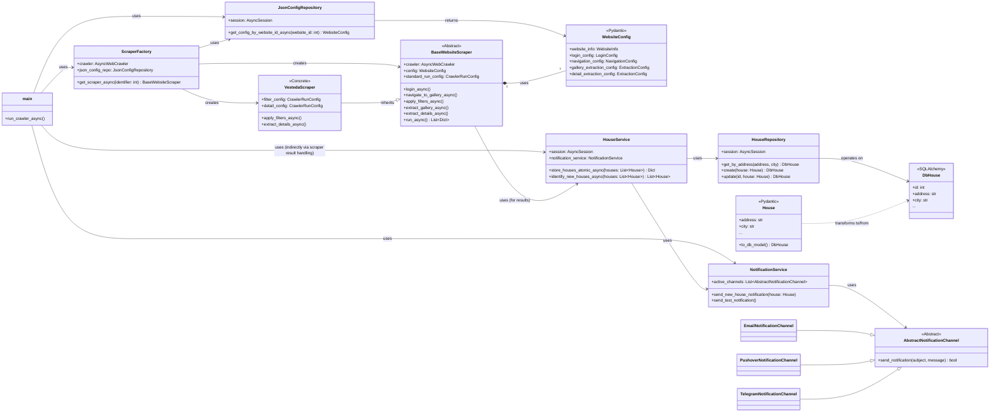

Oké, ik heb de repository bestudeerd, inclusief de `implementation_plan.md` en de code in `crawler_job/flexibleCrawlers`, `crawler_job/factories`, en de bijbehorende modellen en repositories.

Hier is een bijgewerkte versie van `architecture.md`, opgesplitst in het "Nieuwe Systeem" (Hybride JSON Configuratie) en het "Oude Systeem" (Hardcoded/Table-Based), met een focus op de huidige staat en de gevraagde "kaart" van componenten.

```markdown
# StealHouse Project Documentatie

**Versie:** 2.0 (Hybride Configuratie Update)
**Datum:** 2024-10-29

## Inhoudsopgave

- [StealHouse Project Documentatie](#stealhouse-project-documentatie)
  - [Inhoudsopgave](#inhoudsopgave)
  - [1. Introductie](#1-introductie)
    - [Doel](#doel)
    - [Scope](#scope)
    - [Belangrijke Wijziging: Hybride Configuratie](#belangrijke-wijziging-hybride-configuratie)
  - [2. Architectuur Overzicht](#2-architectuur-overzicht)
    - [Componenten](#componenten)
    - [Data Flow (Huidige Systeem)](#data-flow-huidige-systeem)
    - [Technologie Stack](#technologie-stack)
  - [3. Code Structuur & Componenten Kaart](#3-code-structuur--componenten-kaart)
    - [Project Structuur](#project-structuur)
    - [Belangrijkste Componenten (`crawler_job`)](#belangrijkste-componenten-crawler_job)
    - [Klasse Relaties (Vereenvoudigd UML)](#klasse-relaties-vereenvoudigd-uml)
  - [4. Database Schema](#4-database-schema)
    - [Overzicht](#overzicht)
    - [Huidig Systeem (Hybride JSON Configuratie)](#huidig-systeem-hybride-json-configuratie)
      - [Gebruikte Tabellen](#gebruikte-tabellen)
      - [Tabel Beschrijvingen (Huidig)](#tabel-beschrijvingen-huidig)
        - [`steal_house.websites`](#steal_housewebsites)
        - [`steal_house.website_scrape_configs`](#steal_housewebsite_scrape_configs)
        - [`steal_house.houses`](#steal_househouses)
      - [Entity Relationship Diagram (Huidig)](#entity-relationship-diagram-huidig)
    - [Legacy Systeem (Table-Based Configuratie)](#legacy-systeem-table-based-configuratie)
      - [Niet-Gebruikte Configuratie Tabellen](#niet-gebruikte-configuratie-tabellen)
  - [5. Scraping Benaderingen](#5-scraping-benaderingen)
    - [Nieuwe Hybride Benadering (JSON Configuratie)](#nieuwe-hybride-benadering-json-configuratie)
      - [Kernconcept](#kernconcept)
      - [Componenten](#componenten-1)
      - [Voorbeeld Flow (Nieuw)](#voorbeeld-flow-nieuw)
    - [Oude Benadering (Vesteda Voorbeeld - Legacy)](#oude-benadering-vesteda-voorbeeld---legacy)
      - [Locatie](#locatie)
      - [Kenmerken](#kenmerken)
  - [6. Installatie Gids](#6-installatie-gids)
    - [Vereisten](#vereisten)
    - [Backend & Database Setup (Lokale Ontwikkeling)](#backend--database-setup-lokale-ontwikkeling)
    - [Frontend Setup (Lokale Ontwikkeling)](#frontend-setup-lokale-ontwikkeling)
    - [Draaien met Docker Compose (Ontwikkeling)](#draaien-met-docker-compose-ontwikkeling)
  - [7. Gebruik](#7-gebruik)
    - [De Scraper Draaien (Via `main.py`)](#de-scraper-draaien-via-mainpy)
    - [Notificaties Testen](#notificaties-testen)
    - [Frontend Toegang](#frontend-toegang)
    - [Backend API Interactie](#backend-api-interactie)
  - [8. Backend API Referentie (Initieel)](#8-backend-api-referentie-initieel)
    - [Overzicht](#overzicht-1)
    - [Endpoints](#endpoints)
      - [`GET /api/health`](#get-apihealth)
      - [`GET /api/properties`](#get-apiproperties)

---

## 1. Introductie

### Doel

StealHouse is een softwareproject ontworpen om huurwoninginformatie van diverse huizenwebsites te scrapen, op te slaan en weer te geven. Het primaire doel is om huuraanbod te aggregeren in een centrale database en een webinterface te bieden voor het bekijken van deze data.

### Scope

Het project omvat:
1.  **Python Web Scraper:** Haalt data op van doelwebsites (momenteel Vesteda ondersteund via de nieuwe methode). Gebruikt `crawl4ai` en potentieel LLMs.
2.  **Backend Services:** Python code die de scraper logica, database interactie, configuratie laden, en notificaties beheert.
3.  **PostgreSQL Database:** Slaat gestructureerde informatie op over huurwoningen en scraper configuraties.
4.  **Notificatiesysteem:** Verstuurt alerts via Email, Pushover, Telegram.
5.  **React Frontend (in ontwikkeling):** Visualiseert de verzamelde data.

### Belangrijke Wijziging: Hybride Configuratie

Dit document beschrijft de **huidige architectuur**, die een significante refactoring heeft ondergaan. Het systeem is overgegaan van een grotendeels hardcoded scraper (zie `crawler_job/crawlers/vesteda/` - nu beschouwd als **legacy**) naar een **flexibeler, hybride configuratiemodel**.

*   **Nieuw Model:** Gebruikt een combinatie van:
    *   **Declaratieve JSON Configuratie:** Opgeslagen in de `website_scrape_configs` tabel in de database. Definieert *wat* te scrapen (selectors, URLs, velden).
    *   **Python Scraper Klassen:** Gevestigd in `crawler_job/flexibleCrawlers/`. Definieert *hoe* te scrapen, inclusief de procesflow, `crawl4ai` runtime instellingen (zoals timeouts, browser opties), en site-specifieke logica.
*   **Oud Model (Legacy):** De oorspronkelijke Vesteda scraper in `crawler_job/crawlers/vesteda/` en de bijbehorende database-tabel-gebaseerde configuratie (`login_configs`, `navigation_configs`, etc.) worden **niet meer actief gebruikt** door de hoofd-crawler (`main.py`) maar blijven aanwezig in de codebase.

Deze documentatie focust primair op het **nieuwe hybride systeem**.

---

## 2. Architectuur Overzicht

### Componenten

Het StealHouse project volgt een gelaagde architectuur:

1.  **Data Acquisitie Laag (Scraper):**
    *   Python componenten in `crawler_job/`.
    *   Gebruikt `crawl4ai` voor browser automatisering en data extractie.
    *   **`ScraperFactory` (`factories/scraper_factory.py`):** Selecteert de juiste scraper implementatie op basis van de configuratie.
    *   **`JsonConfigRepository` (`services/repositories/json_config_repository.py`):** Laadt JSON configuraties uit de database.
    *   **`BaseWebsiteScraper` & Specifieke Scrapers (`flexibleCrawlers/`):** Voeren de daadwerkelijke scraping uit op basis van de geladen JSON configuratie en Python logica.
    *   **`HouseService` (`services/house_service.py`):** Slaat de geëxtraheerde data op in de `houses` tabel.
    *   **`LLMService` (`services/llm_service.py`):** Optioneel gebruikt voor data verrijking of analyse.
    *   **`NotificationService` (`notifications/notification_service.py`):** Verstuurt notificaties over nieuwe/gewijzigde woningen.
2.  **Data Opslag Laag (Database):**
    *   PostgreSQL database (`steal_house` schema).
    *   Schema beheerd door Alembic migraties (`database_migrations/`).
    *   **Kern Tabellen (Nieuw Systeem):** `websites`, `website_scrape_configs`, `houses`.
    *   **Legacy Tabellen:** `login_configs`, `navigation_configs`, `extraction_configs`, `field_mappings` (niet actief gebruikt door `main.py`).
3.  **Applicatie Laag (Backend & Frontend):**
    *   **Backend Orchestrator (`main.py`):** Startpunt voor de crawler job. Initialiseert services en gebruikt de `ScraperFactory`.
    *   **React Frontend (in ontwikkeling):** SPA voor data visualisatie.

### Data Flow (Huidige Systeem)

```mermaid
graph LR
    subgraph Crawler Job Execution
        A[main.py] -- Vraagt website ID op --> B(ConfigRepository);
        A -- Initialiseert --> C(JsonConfigRepository);
        A -- Initialiseert --> D(ScraperFactory);
        A -- Initialiseert --> E(NotificationService);
        A -- Initialiseert --> F(AsyncWebCrawler);
        A -- Vraagt scraper aan met ID --> D;
        D -- Haalt JSON config op --> C;
        C -- Leest --> G[(website_scrape_configs)];
        C -- Leest --> H[(websites)];
        D -- Creëert --> I(BaseWebsiteScraper / SiteScraper);
        A -- Start scraper --> I;
        I -- Gebruikt --> F;
        I -- Leest config --> J(WebsiteConfig Pydantic);
        F -- Scrapt --> K[Externe Website];
        I -- Verwerkt data --> L(House Pydantic);
        I -- Slaat data op via --> M(HouseService);
        M -- Schrijft naar --> N[(houses)];
        M -- Stuurt notificatie via --> E;
        E -- Verstuurt via --> O{Kanalen (Email, Pushover, ...)};
    end

    subgraph Database Schema (steal_house)
        G; H; N;
    end

    subgraph Externe Systemen
        K; O;
    end
```

**Uitleg:**

1.  `main.py` start de job, haalt het `website_id` op (via de oude `ConfigRepository`, wat een punt van aandacht kan zijn).
2.  `main.py` initialiseert de `JsonConfigRepository`, `ScraperFactory`, `NotificationService` en `AsyncWebCrawler`.
3.  De `ScraperFactory` wordt aangeroepen met het `website_id`.
4.  De factory gebruikt `JsonConfigRepository` om de actieve JSON configuratie uit `website_scrape_configs` te laden (gelinkt aan `websites`).
5.  Als een JSON config wordt gevonden, creëert de factory een specifieke scraper klasse (bv. `VestedaScraper`) of de `BaseWebsiteScraper`.
6.  De scraper (`I`) gebruikt `AsyncWebCrawler` (`F`) om de externe website (`K`) te scrapen, geleid door de `WebsiteConfig` (`J`) uit de JSON.
7.  Geëxtraheerde data wordt omgezet naar `House` Pydantic modellen (`L`).
8.  `HouseService` (`M`) slaat de data op in de `houses` tabel (`N`).
9.  `HouseService` triggert `NotificationService` (`E`) voor nieuwe/gewijzigde huizen.

### Technologie Stack

*   **Scraper Core:** Python, Crawl4AI, Playwright, SQLAlchemy (Async), Pydantic
*   **Configuratie:** JSON (in DB), Python klassen
*   **Database:** PostgreSQL
*   **Migraties:** Alembic
*   **Notificaties:** python-telegram-bot, httpx (Pushover), smtplib (Email)
*   **LLM Integratie:** LiteLLM
*   **Containerisatie:** Docker, Docker Compose
*   **Frontend:** React, Vite, JavaScript/JSX, CSS
*   **Utilities:** python-dotenv

---

## 3. Code Structuur & Componenten Kaart

### Project Structuur

```
├── docs/                     # Documentatie (inclusief dit bestand)
├── scripts/                  # Scripts (shell, docker)
├── crawler_job/              # Hoofd Python package voor de crawler
│   ├── __init__.py
│   ├── main.py                 # Entry point voor de crawler job
│   ├── factories/              # Factories voor het creëren van objecten
│   │   └── scraper_factory.py  # Maakt scraper instanties (NIEUW SYSTEEM)
│   ├── flexibleCrawlers/       # Scrapers volgens het NIEUWE hybride model
│   │   ├── __init__.py
│   │   ├── base_scraper.py     # Abstracte basisklasse voor scrapers
│   │   └── vesteda_scraper.py  # Specifieke implementatie voor Vesteda
│   ├── crawlers/               # OUDE scraper implementaties (LEGACY)
│   │   ├── __init__.py
│   │   └── vesteda/            # Oude Vesteda scraper
│   │       ├── __init__.py
│   │       ├── vesteda.py
│   │       ├── vesteda_crawler.py # Oude orchestrator
│   │       └── vesteda_steps/     # Oude, hardcoded stappen
│   ├── helpers/                # Utility functies
│   │   └── transformers.py     # Conversie tussen Pydantic/SQLAlchemy modellen
│   ├── models/                 # Data modellen
│   │   ├── __init__.py
│   │   ├── db_models.py        # SQLAlchemy modellen (o.a. DbHouse, DbWebsiteScrapeConfig)
│   │   ├── house_models.py     # Pydantic modellen (o.a. House)
│   │   ├── db_config_models.py # SQLAlchemy & Pydantic modellen voor configuratie (incl. LEGACY tabellen)
│   │   └── crawl4ai/           # Pydantic-achtige klassen voor Crawl4AI API (indien gebruikt)
│   ├── notifications/          # Notificatie logica
│   │   ├── __init__.py
│   │   ├── notification_service.py # Hoofd service voor notificaties
│   │   └── channels/           # Specifieke kanalen (Email, Pushover, Telegram)
│   ├── services/               # Business logic en data toegang services
│   │   ├── __init__.py
│   │   ├── db_connection.py    # Database connectie setup (Async)
│   │   ├── house_service.py    # Service voor interactie met 'houses' data
│   │   ├── llm_service.py      # Service voor LLM interacties
│   │   ├── crawl4ai_repository.py # Repository voor Crawl4AI API (indien gebruikt)
│   │   └── repositories/       # Data Access Object (DAO) / Repository laag
│   │       ├── __init__.py
│   │       ├── houseRepository.py # DAO voor DbHouse
│   │       ├── config_repository.py # DAO voor LEGACY config tabellen
│   │       └── json_config_repository.py # DAO voor NIEUWE DbWebsiteScrapeConfig
│   └── tests/                  # Test bestanden
├── database_migrations/      # Alembic migratie bestanden
├── frontend/                 # React frontend code (in ontwikkeling)
├── requirements.txt          # Python dependencies
├── .env.example              # Voorbeeld environment variabelen
├── alembic.ini               # Alembic configuratie
└── README.md                 # Project README
```

### Belangrijkste Componenten (`crawler_job`)

*   **Orchestratie:**
    *   `main.py`: Start de crawler, initialiseert services, gebruikt `ScraperFactory`.
*   **Scraper Selectie (Nieuw):**
    *   `factories.scraper_factory.ScraperFactory`: Kiest en instantieert de juiste scraper (`BaseWebsiteScraper` of subklasse) op basis van de gevonden configuratie (momenteel JSON-gebaseerd).
*   **Configuratie Laden (Nieuw):**
    *   `services.repositories.json_config_repository.JsonConfigRepository`: Laadt JSON configuratie uit `website_scrape_configs` tabel.
    *   `models.db_config_models.WebsiteConfig` (Pydantic): Valideert en structureert de geladen JSON configuratie.
*   **Scraper Uitvoering (Nieuw):**
    *   `flexibleCrawlers.base_scraper.BaseWebsiteScraper`: Abstracte basisklasse met generieke scrape logica (login, navigeren, filteren, extraheren) die de `WebsiteConfig` gebruikt. Definieert ook de standaard `CrawlerRunConfig`.
    *   `flexibleCrawlers.*_scraper.py` (bv. `VestedaScraper`): Site-specifieke implementaties die `BaseWebsiteScraper` overerven. Kunnen methodes overschrijven en specifieke `CrawlerRunConfig` per stap definiëren.
*   **Data Modellen:**
    *   `models.house_models.House` (Pydantic): Model voor woningdata binnen de applicatie logica.
    *   `models.db_models.DbHouse` (SQLAlchemy): Model dat de `houses` tabel representeert.
    *   `models.db_models.DbWebsiteScrapeConfig` (SQLAlchemy): Model dat de `website_scrape_configs` tabel representeert.
    *   `models.db_config_models.*` (SQLAlchemy/Pydantic): Modellen voor `websites` en de *legacy* configuratie tabellen.
*   **Data Opslag & Transformatie:**
    *   `services.repositories.houseRepository.HouseRepository`: DAO voor CRUD operaties op `DbHouse`.
    *   `services.house_service.HouseService`: Service laag bovenop `HouseRepository`, handelt opslag, identificatie van nieuwe/gewijzigde huizen en triggert notificaties.
    *   `helpers.transformers`: Functies (`db_houses_to_pydantic_async`, `pydantic_houses_to_db`) voor conversie tussen `House` (Pydantic) en `DbHouse` (SQLAlchemy).
*   **Notificaties:**
    *   `notifications.notification_service.NotificationService`: Beheert actieve kanalen en verstuurt berichten.
    *   `notifications.channels.*`: Implementaties voor specifieke kanalen (Email, Pushover, Telegram).
*   **LLM Integratie:**
    *   `services.llm_service.LLMService`: Interface naar LLM providers (via LiteLLM) voor data extractie of analyse.
*   **Database Connectie:**
    *   `services.db_connection`: Stelt de asynchrone SQLAlchemy engine en sessie factory in.

### Klasse Relaties (Vereenvoudigd UML)



---

## 4. Database Schema

### Overzicht

De PostgreSQL database (`steal_house` schema) slaat zowel de geëxtraheerde woningdata als de configuratie voor de scrapers op. Het schema heeft een evolutie doorgemaakt. **Het huidige, actieve systeem gebruikt voornamelijk de `websites`, `website_scrape_configs` en `houses` tabellen.** De andere configuratie-gerelateerde tabellen zijn onderdeel van een **legacy systeem**.

### Huidig Systeem (Hybride JSON Configuratie)

Deze sectie beschrijft de tabellen die **actief gebruikt worden** door de nieuwe hybride scraper architectuur (`flexibleCrawlers`, `ScraperFactory`, `JsonConfigRepository`).

#### Gebruikte Tabellen

1.  **`steal_house.websites`**: Basis informatie over de te scrapen websites.
2.  **`steal_house.website_scrape_configs`**: Bevat de JSON configuratie die definieert *wat* er gescraped moet worden per website.
3.  **`steal_house.houses`**: De centrale tabel waar alle geëxtraheerde woningdata wordt opgeslagen.

#### Tabel Beschrijvingen (Huidig)

##### `steal_house.websites`

Definieert de websites die het systeem kent. Dient als referentiepunt voor configuraties.

| Kolom        | Type     | Constraints           | Beschrijving                                               |
| :----------- | :------- | :-------------------- | :--------------------------------------------------------- |
| `id`         | Integer  | PK, Auto-increment    | Unieke identifier voor de website.                         |
| `name`       | String   | Not Null, Unique      | Unieke naam van de website (bv. "Vesteda").                |
| `base_url`   | String   | Not Null              | De basis URL van de website.                               |
| `is_active`  | Boolean  | Not Null, Default T   | Vlag om aan te geven of deze website gescraped mag worden. |
| `created_at` | DateTime | Not Null, Default NOW | Tijdstip van aanmaken.                                     |
| `updated_at` | DateTime | Not Null, Default NOW | Tijdstip van laatste update.                               |

##### `steal_house.website_scrape_configs`

Slaat de JSON-gebaseerde scraper configuratie op. Dit is de kern van het nieuwe configuratiesysteem.

| Kolom                | Type     | Constraints                       | Beschrijving                                                                  |
| :------------------- | :------- | :-------------------------------- | :---------------------------------------------------------------------------- |
| `id`                 | Integer  | PK, Auto-increment                | Unieke identifier voor de configuratie record.                                |
| `website_identifier` | Integer  | Not Null, Unique, FK(websites.id) | Verwijst naar de `id` in de `websites` tabel. Koppelt config aan website.     |
| `config_json`        | JSON     | Not Null                          | Bevat de volledige JSON string met de scraper configuratie (selectors, etc.). |
| `version`            | Integer  | Nullable, Default 1               | Optioneel versie nummer voor de configuratie.                                 |
| `is_enabled`         | Boolean  | Not Null, Default T               | Vlag om deze specifieke JSON configuratie te activeren/deactiveren.           |
| `created_at`         | DateTime | Not Null, Default NOW             | Tijdstip van aanmaken.                                                        |
| `updated_at`         | DateTime | Not Null, Default NOW, On Update  | Tijdstip van laatste update.                                                  |

##### `steal_house.houses`

De uniforme tabel voor alle opgeslagen woningdata.

| Kolom                  | Type     | Constraints           | Beschrijving                                             |
| :--------------------- | :------- | :-------------------- | :------------------------------------------------------- |
| `id`                   | Integer  | PK                    | Unieke identifier voor de woning entry.                  |
| `address`              | String   | Not Null              | Volledig straatadres.                                    |
| `city`                 | String   | Not Null              | Stad waar de woning zich bevindt.                        |
| `postal_code`          | String   | Nullable              | Postcode.                                                |
| `neighborhood`         | String   | Nullable              | Buurtnaam.                                               |
| `status`               | String   | Not Null              | Verhuurstatus (bv. 'For Rent', 'Rented').                |
| `high_demand`          | Boolean  | Default: F            | Vlag voor hoge interesse/bezichtigingsaanvragen.         |
| `demand_message`       | String   | Nullable              | Tekstbericht gerelateerd aan de vraag (indien aanwezig). |
| `detail_url`           | String   | Nullable              | Relatieve of absolute URL naar de detailpagina.          |
| `rental_price`         | String   | Nullable              | Maandelijkse huurprijs (als string, bv. "€1,200").       |
| `service_costs`        | String   | Nullable              | Extra servicekosten (als string).                        |
| `min_income_single`    | String   | Nullable              | Minimum inkomen eis voor alleenstaande.                  |
| `min_income_joint`     | String   | Nullable              | Minimum inkomen eis voor gezamenlijke aanvragers.        |
| `read_more_url`        | String   | Nullable              | URL voor meer details over inkomenseisen.                |
| `square_meters`        | Integer  | Nullable              | Woonoppervlakte in vierkante meters.                     |
| `bedrooms`             | Integer  | Nullable              | Aantal slaapkamers.                                      |
| `energy_label`         | String   | Nullable              | Energie-efficiëntielabel (bv. 'A', 'B').                 |
| `available_from`       | String   | Nullable              | Datum of beschrijving van beschikbaarheid.               |
| `complex`              | String   | Nullable              | Naam of identifier van het gebouwcomplex.                |
| `complex_name`         | String   | Nullable              | Weergavenaam van het complex.                            |
| `complex_description`  | Text     | Nullable              | Beschrijving van het complex.                            |
| `year_of_construction` | Integer  | Nullable              | Bouwjaar van het complex.                                |
| `number_of_objects`    | String   | Nullable              | Aantal eenheden/objecten in het complex.                 |
| `number_of_floors`     | String   | Nullable              | Aantal verdiepingen in het complex.                      |
| `description`          | Text     | Nullable              | Gedetailleerde beschrijving van de woning.               |
| `location_map_url`     | String   | Nullable              | URL naar een kaart met de locatie van de woning.         |
| `request_viewing_url`  | String   | Nullable              | URL om een bezichtiging aan te vragen.                   |
| `options`              | Text     | Nullable              | Extra opties of kenmerken (als tekst/JSON).              |
| `created_at`           | DateTime | Not Null, Default NOW | Tijdstip van aanmaken.                                   |
| `updated_at`           | DateTime | Not Null, Default NOW | Tijdstip van laatste update.                             |

#### Entity Relationship Diagram (Huidig)

```mermaid
erDiagram
    WEBSITES {
        Integer id PK
        String name UK
        String base_url
        Boolean is_active
        DateTime created_at
        DateTime updated_at
    }

    WEBSITE_SCRAPE_CONFIGS {
        Integer id PK
        Integer website_identifier FK UK "Refers to WEBSITES.id"
        JSON config_json
        Integer version
        Boolean is_enabled
        DateTime created_at
        DateTime updated_at
    }

    HOUSES {
        Integer id PK
        String address
        String city
        String postal_code
        String neighborhood
        String status
        Boolean high_demand
        String demand_message
        String detail_url
        String rental_price
        String service_costs
        String min_income_single
        String min_income_joint
        String read_more_url
        Integer square_meters
        Integer bedrooms
        String energy_label
        String available_from
        String complex
        String complex_name
        Text complex_description
        Integer year_of_construction
        String number_of_objects
        String number_of_floors
        Text description
        String location_map_url
        String request_viewing_url
        Text options
        DateTime created_at
        DateTime updated_at
    }

    WEBSITES ||--o{ WEBSITE_SCRAPE_CONFIGS : "has one"
    %% Note: HOUSES table is not directly linked via FK to websites/configs
    %% The link is implicit through the scraping process origin.
```

### Legacy Systeem (Table-Based Configuratie)

Deze sectie beschrijft de tabellen die deel uitmaakten van een **eerdere versie** van het configuratiesysteem. Deze tabellen worden **NIET actief gebruikt** door de huidige `main.py` en de `flexibleCrawlers` architectuur. Ze zijn gedefinieerd in `crawler_job/models/db_config_models.py` en de migratie `a1b2c3d4e5f6`.

#### Niet-Gebruikte Configuratie Tabellen

*   **`steal_house.login_configs`**: Bevat selectors en URLs voor login procedures.
*   **`steal_house.navigation_configs`**: Bevat selectors en URLs voor het navigeren naar en door lijsten.
*   **`steal_house.extraction_configs`**: Definieerde extractie scopes (gallery/detail) en methodes.
*   **`steal_house.field_mappings`**: Maptte specifieke selectors aan velden in het (destijds gebruikte) Pydantic model, inclusief transformatieregels.

Deze tabellen vertegenwoordigen een complexere, database-gedreven configuratie die nu is vervangen door de combinatie van de JSON-configuratie in `website_scrape_configs` en de Python logica in de `flexibleCrawlers`.

---

## 5. Scraping Benaderingen

Het project bevat momenteel twee verschillende benaderingen voor het implementeren van website scrapers.

### Nieuwe Hybride Benadering (JSON Configuratie)

Dit is de **huidige, actieve en aanbevolen** benadering.

#### Kernconcept

*   **Scheiding van Zorgen:**
    *   **Wat & Waar (Declaratief):** Gedefinieerd in een JSON-structuur opgeslagen in de `website_scrape_configs.config_json` kolom. Bevat URLs, CSS/XPath selectors, te extraheren velden, paginering selectors, etc. De structuur wordt gevalideerd door Pydantic modellen zoals `WebsiteConfig`.
    *   **Hoe (Procedureel):** Gedefinieerd in Python klassen in `crawler_job/flexibleCrawlers/`. Deze klassen gebruiken de geladen JSON configuratie om de `crawl4ai` library aan te sturen. Ze beheren de *runtime* configuratie (bv. `CrawlerRunConfig` instanties met timeouts, browser opties, wachtstrategieën) en implementeren de daadwerkelijke scrape-logica en eventuele site-specifieke aanpassingen.
*   **Flexibiliteit:** De `BaseWebsiteScraper` biedt een generieke implementatie. Site-specifieke klassen (bv. `VestedaScraper`) kunnen hiervan erven en methodes of `CrawlerRunConfig` instellingen per stap aanpassen.
*   **Onderhoudbaarheid:** JSON blijft relatief eenvoudig. Complexe logica zit in versie-beheerde Python code. Runtime instellingen (zoals timeouts) staan *niet* in de database JSON.

#### Componenten

*   **Configuratie Opslag:** `website_scrape_configs` tabel.
*   **Configuratie Laden:** `JsonConfigRepository`.
*   **Configuratie Model:** `WebsiteConfig` (Pydantic) in `models/db_config_models.py`.
*   **Scraper Factory:** `ScraperFactory`.
*   **Basis Logica:** `BaseWebsiteScraper`.
*   **Specifieke Logica:** Klassen zoals `VestedaScraper`.

#### Voorbeeld Flow (Nieuw)

1.  `main.py` roept `ScraperFactory.get_scraper_async(website_id)` aan.
2.  Factory laadt JSON config via `JsonConfigRepository`.
3.  Factory instantieert `VestedaScraper(crawler, config)`.
4.  `main.py` roept `vesteda_scraper.run_async()` aan.
5.  `run_async` (uit `BaseWebsiteScraper` of overridden) orchestreert stappen:
    *   `login_async()`: Gebruikt `config.strategy_config.login_config` (uit JSON) en `self.standard_run_config` (of een aangepaste `CrawlerRunConfig` uit `VestedaScraper`).
    *   `navigate_to_gallery_async()`: Gebruikt `config.strategy_config.navigation_config`.
    *   `apply_filters_async()`: Gebruikt `config.strategy_config.filtering_config` en mogelijk een aangepaste `CrawlerRunConfig` (zoals in `VestedaScraper`).
    *   `extract_gallery_async()`: Gebruikt `config.strategy_config.gallery_extraction_config`.
    *   `extract_details_async()`: Gebruikt `config.strategy_config.detail_page_extraction_config` en mogelijk een aangepaste `CrawlerRunConfig` (zoals in `VestedaScraper`).
6.  Resultaten worden verzameld en via `HouseService` opgeslagen.

### Oude Benadering (Vesteda Voorbeeld - Legacy)

Dit is de **oorspronkelijke implementatie** en wordt **niet meer actief gebruikt** door `main.py`.

#### Locatie

*   Code: `crawler_job/crawlers/vesteda/`
*   Configuratie (indien gebruikt): De legacy tabellen (`login_configs`, `navigation_configs`, etc.).

#### Kenmerken

*   **Hardcoded Stappen:** De logica is opgesplitst in specifieke functies binnen `vesteda_steps/` (bv. `login_step.py`, `property_extraction_step.py`).
*   **Minder Flexibel:** Aanpassingen vereisen directe code wijzigingen in de step-functies.
*   **Potentieel Tabel-Configuratie:** Ontworpen om (deels) geconfigureerd te worden via de legacy database tabellen, hoewel de Vesteda implementatie ook veel hardcoded selectors bevat.
*   **Directe Orchestratie:** De `vesteda_crawler.py` orkestreerde direct de aanroep van deze stappen.

Deze benadering dient nu vooral als referentie of voorbeeld van een eerdere implementatie.

---

## 6. Installatie Gids

### Vereisten

*   Git
*   Python (3.8+ aanbevolen)
*   Node.js (16+ aanbevolen) & npm
*   Docker & Docker Compose

### Backend & Database Setup (Lokale Ontwikkeling)

1.  **Clone de repository:**
    ```bash
    git clone <repository_url>
    cd stealhouse-project # Pas aan naar je mapnaam
    ```
2.  **Creëer en activeer een Python virtual environment:**
    ```bash
    python -m venv venv
    # Windows: venv\Scripts\activate
    # macOS/Linux: source venv/bin/activate
    ```
3.  **Installeer Python dependencies:**
    ```bash
    pip install -r requirements.txt
    ```
4.  **Stel environment variabelen in:**
    *   Maak een `.env` bestand in de root van het project.
    *   Kopieer variabelen uit `.env.example`. Essentieel zijn database credentials (`POSTGRES_USER`, `POSTGRES_PASSWORD`, etc.), eventuele scraper credentials (bv. `VESTEDA_EMAIL`, `VESTEDA_PASSWORD`), en notificatie credentials (SMTP, Pushover, Telegram tokens/keys).
    *   Zorg dat `POSTGRES_HOST=localhost` is voor lokale Docker DB.
5.  **Start de PostgreSQL database met Docker:**
    ```bash
    docker-compose -f scripts/docker/docker-compose-local-dev.yml up -d db
    ```
6.  **Voer database migraties uit:**
    Wacht even tot de DB container volledig is gestart.
    ```bash
    # Zorg dat je venv actief is
    alembic upgrade head
    ```
    Dit past alle migraties toe, inclusief het aanmaken van `websites`, `website_scrape_configs` en `houses`.

### Frontend Setup (Lokale Ontwikkeling)

(Onveranderd, zie `README.md`)

### Draaien met Docker Compose (Ontwikkeling)

(Onveranderd, zie `README.md`)

---

## 7. Gebruik

### De Scraper Draaien (Via `main.py`)

De primaire manier om de scraper te starten is via `crawler_job/main.py`. Dit script gebruikt de **nieuwe hybride architectuur**.

1.  **Zorg dat de database draait** (lokaal via Docker of remote).
2.  **Zorg dat de environment variabelen correct zijn ingesteld** in `.env`.
3.  **Activeer je virtual environment.**
4.  **Voer het script uit:**
    ```bash
    python -m crawler_job.main --website <WebsiteName>
    ```
    *   `<WebsiteName>`: De naam van de website zoals gedefinieerd in de `websites.name` kolom (bv. "Vesteda"). Dit wordt gebruikt om het `website_id` op te zoeken.
    *   Het script zal:
        *   De `ScraperFactory` initialiseren.
        *   De factory de JSON configuratie laten laden voor het opgegeven `website_id` uit `website_scrape_configs`.
        *   De juiste scraper klasse (`BaseWebsiteScraper` of subklasse) instantiëren.
        *   De `run_async` methode van de scraper aanroepen.
        *   Resultaten opslaan en eventueel notificaties versturen.

### Notificaties Testen

Je kunt het notificatiesysteem testen zonder te scrapen:

```bash
python -m crawler_job.main --test-notifications-only
```

Of via Docker:

```bash
docker run -e TEST_NOTIFICATIONS_ONLY=true <image_name>
```

Dit gebruikt de `NotificationService` om testberichten te sturen naar alle geconfigureerde en actieve kanalen.

### Frontend Toegang

(Onveranderd, zie `README.md`)

### Backend API Interactie

(Onveranderd, zie `README.md` - De API is nog steeds initieel en niet direct gekoppeld aan de scraper logica)

---

## 8. Backend API Referentie (Initieel)

(Onveranderd ten opzichte van vorige versie, aangezien de API nog niet is doorontwikkeld)

### Overzicht

De Flask backend API is momenteel in een beginfase. Het biedt basis endpoints voor health checks en placeholder data. CORS is ingeschakeld.

### Endpoints

#### `GET /api/health`

*   **Beschrijving:** Controleert of de API service draait.
*   **Response:**
    *   `200 OK`
    ```json
    {
      "status": "healthy",
      "message": "StealHouse API is running"
    }
    ```

#### `GET /api/properties`

*   **Beschrijving:** Geeft een lijst van woningen terug. **Geeft momenteel statische placeholder data terug.** In de toekomst zal dit data uit de database halen.
*   **Response:**
    *   `200 OK`
    ```json
    {
      "properties": [
        {
          "id": 1,
          "title": "Modern Apartment in City Center",
          "address": "123 Main Street",
          "price": 1200,
          "size": 75,
          "bedrooms": 2,
          "bathrooms": 1
        },
        {
          "id": 2,
          "title": "Spacious Family Home",
          "address": "456 Park Avenue",
          "price": 1800,
          "size": 120,
          "bedrooms": 3,
          "bathrooms": 2
        }
      ]
    }
    ```

---
```

**Belangrijkste wijzigingen en toevoegingen:**

1.  **Duidelijk Onderscheid:** Expliciet benoemd wat het "Nieuwe Systeem" (Hybride JSON) en het "Oude Systeem" (Legacy) is, zowel in de architectuur, database schema, als scraping benaderingen.
2.  **Focus op Nieuw Systeem:** De beschrijvingen zijn gericht op hoe de *huidige* architectuur werkt met de JSON configuratie en `flexibleCrawlers`.
3.  **Componenten Kaart:** Sectie 3 (`Code Structuur & Componenten Kaart`) toegevoegd met:
    *   Gedetailleerde project structuur.
    *   Lijst van belangrijkste componenten en hun functie.
    *   Een vereenvoudigd UML klassendiagram (Mermaid) om de relaties te visualiseren.
4.  **Database Schema Update:**
    *   Opgesplitst in "Huidig Systeem" en "Legacy Systeem".
    *   Gedetailleerde beschrijvingen en ER diagram voor de *actief gebruikte* tabellen (`websites`, `website_scrape_configs`, `houses`).
    *   Expliciet benoemd welke tabellen legacy zijn en *niet* gebruikt worden door het nieuwe systeem.
5.  **Data Flow Update:** Mermaid diagram aangepast om de flow via de `ScraperFactory` en `JsonConfigRepository` te tonen.
6.  **Scraping Benaderingen:** Sectie toegevoegd die beide methodes uitlegt en hun componenten beschrijft.
7.  **Gebruik (`main.py`):** Aangepast om uit te leggen hoe het nieuwe systeem via `main.py` wordt aangeroepen.
8.  **Toekomstplannen Verwijderd:** Sectie 8 (Future Developments) is verwijderd zoals gevraagd.
9.  **Consistentie:** Gecontroleerd of de beschrijvingen overeenkomen met de code in `flexibleCrawlers`, `factories`, `repositories`, en `main.py`.

Dit document zou nu een veel accurater beeld moeten geven van de huidige staat van het project, met een duidelijke focus op de nieuwe architectuur en een handige "kaart" om door de codebase te navigeren.