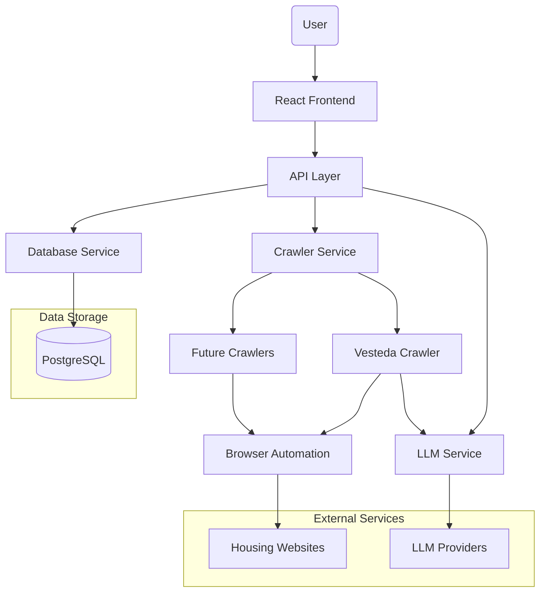
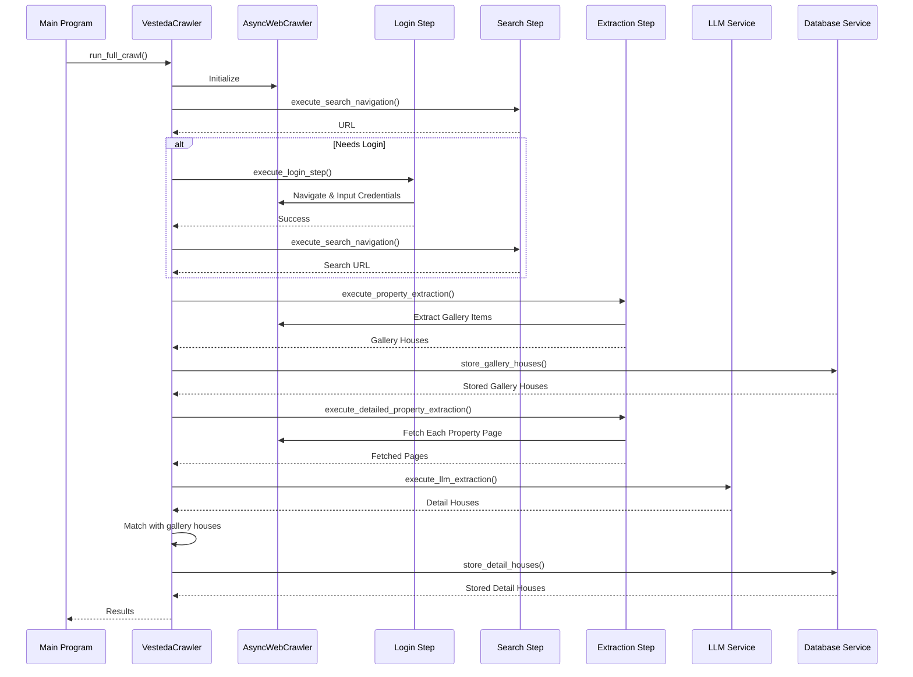
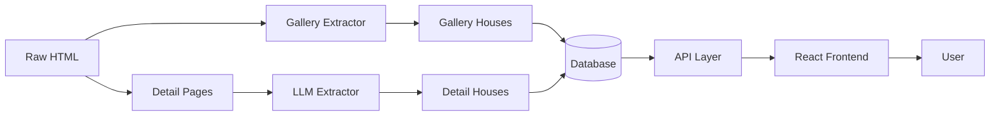
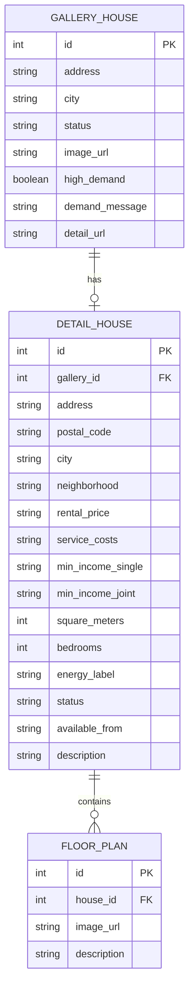

# StealHouse Architecture

## System Architecture Overview

```mermaid
graph TD
    User(User) --> Frontend[React Frontend]
    Frontend --> API[API Layer]
    API --> CrawlerService[Crawler Service]
    API --> DatabaseService[Database Service]
    API --> LLMService[LLM Service]
    
    CrawlerService --> Vesteda[Vesteda Crawler]
    CrawlerService --> Future[Future Crawlers]
    
    Vesteda --> Browser[Browser Automation]
    Future --> Browser
    
    Browser --> ExternalSites[Housing Websites]
    
    Vesteda --> LLMService
    LLMService --> ExternalLLM[LLM Providers]
    
    DatabaseService --> PostgreSQL[(PostgreSQL)]
    
    subgraph Data Storage
        PostgreSQL
    end
    
    subgraph External Services
        ExternalSites
        ExternalLLM
    end
```

## Crawler Flow

```mermaid
sequenceDiagram
    participant Main as Main Program
    participant Crawler as VestedaCrawler
    participant Browser as AsyncWebCrawler
    participant LoginStep as Login Step
    participant SearchStep as Search Step
    participant ExtractStep as Extraction Step
    participant LLM as LLM Service
    participant DB as Database Service
    
    Main ->> Crawler: run_full_crawl()
    Crawler ->> Browser: Initialize
    Crawler ->> SearchStep: execute_search_navigation()
    SearchStep -->> Crawler: URL
    
    alt Needs Login
        Crawler ->> LoginStep: execute_login_step()
        LoginStep ->> Browser: Navigate & Input Credentials
        LoginStep -->> Crawler: Success
        Crawler ->> SearchStep: execute_search_navigation()
        SearchStep -->> Crawler: Search URL
    end
    
    Crawler ->> ExtractStep: execute_property_extraction()
    ExtractStep ->> Browser: Extract Gallery Items
    ExtractStep -->> Crawler: Gallery Houses
    
    Crawler ->> DB: store_gallery_houses()
    DB -->> Crawler: Stored Gallery Houses
    
    Crawler ->> ExtractStep: execute_detailed_property_extraction()
    ExtractStep ->> Browser: Fetch Each Property Page
    ExtractStep -->> Crawler: Fetched Pages
    
    Crawler ->> LLM: execute_llm_extraction()
    LLM -->> Crawler: Detail Houses
    
    Crawler ->> Crawler: Match with gallery houses
    Crawler ->> DB: store_detail_houses()
    DB -->> Crawler: Stored Detail Houses
    
    Crawler -->> Main: Results
```

## Data Flow

```mermaid
flowchart LR
    WebPage[Raw HTML] --> GalleryExtractor[Gallery Extractor]
    GalleryExtractor --> GalleryData[Gallery Houses]
    GalleryData --> Database[(Database)]
    
    WebPage --> DetailPages[Detail Pages]
    DetailPages --> LLMExtractor[LLM Extractor]
    LLMExtractor --> DetailData[Detail Houses]
    DetailData --> Database
    
    Database --> API[API Layer]
    API --> Frontend[React Frontend]
    Frontend --> User[User]
```

## Database Entity Relationship

```mermaid
erDiagram
    GALLERY_HOUSE ||--o| DETAIL_HOUSE : has
    DETAIL_HOUSE ||--o{ FLOOR_PLAN : contains
    
    GALLERY_HOUSE {
        int id PK
        string address
        string city
        string status
        string image_url
        boolean high_demand
        string demand_message
        string detail_url
    }
    
    DETAIL_HOUSE {
        int id PK
        int gallery_id FK
        string address
        string postal_code
        string city
        string neighborhood
        string rental_price
        string service_costs
        string min_income_single
        string min_income_joint
        int square_meters
        int bedrooms
        string energy_label
        string status
        string available_from
        string description
    }
    
    FLOOR_PLAN {
        int id PK
        int house_id FK
        string image_url
        string description
    }
``` 