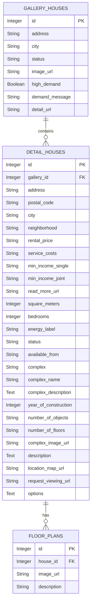
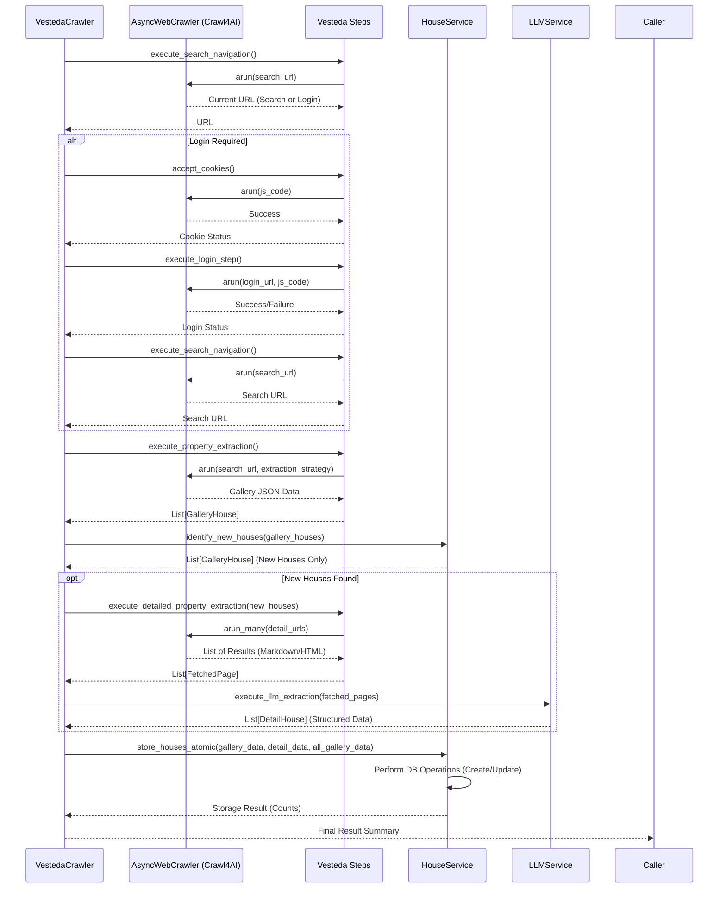

# StealHouse Project Documentation

**Version:** 1.0
**Date:** 2024-10-27

## Table of Contents

- [StealHouse Project Documentation](#stealhouse-project-documentation)
  - [Table of Contents](#table-of-contents)
  - [1. Introduction](#1-introduction)
    - [Purpose](#purpose)
    - [Scope](#scope)
    - [Project Status](#project-status)
  - [2. Architecture](#2-architecture)
    - [Component Overview](#component-overview)
    - [Data Flow](#data-flow)
    - [Technology Stack](#technology-stack)
  - [3. Installation Guide](#3-installation-guide)
    - [Prerequisites](#prerequisites)
    - [Backend \& Database Setup (Local Development)](#backend--database-setup-local-development)
    - [Frontend Setup (Local Development)](#frontend-setup-local-development)
    - [Running with Docker Compose (Development)](#running-with-docker-compose-development)
  - [4. Usage](#4-usage)
    - [Running the Scraper](#running-the-scraper)
    - [Accessing the Frontend](#accessing-the-frontend)
    - [Interacting with the Backend API](#interacting-with-the-backend-api)
  - [5. Database Schema](#5-database-schema)
    - [Overview](#overview)
    - [Entity Relationship Diagram](#entity-relationship-diagram)
    - [Table Descriptions](#table-descriptions)
      - [`gallery_houses`](#gallery_houses)
      - [`detail_houses`](#detail_houses)
      - [`floor_plans`](#floor_plans)
  - [6. Crawler Details (Vesteda)](#6-crawler-details-vesteda)
    - [Overview](#overview-1)
    - [Core Logic Flow](#core-logic-flow)
    - [Key Components](#key-components)
  - [7. Backend API Reference (Initial)](#7-backend-api-reference-initial)
    - [Overview](#overview-2)
    - [Endpoints](#endpoints)
      - [`GET /api/health`](#get-apihealth)
      - [`GET /api/properties`](#get-apiproperties)
  - [8. Future Developments](#8-future-developments)

---

## 1. Introduction

### Purpose

StealHouse is a software project designed to scrape, store, and display rental property information from various housing websites. The primary goal is to aggregate rental listings into a centralized database and provide a web interface for viewing this data. The system leverages web scraping techniques, potentially enhanced by Large Language Models (LLMs) for intelligent data extraction, and uses a modern web stack for data presentation.

### Scope

The project encompasses three main components:
1.  **Python Web Scraper:** Responsible for fetching and extracting data from target rental websites (e.g., Vesteda). It utilizes libraries like `crawl4ai` for advanced crawling and potentially LLMs for data structuring.
2.  **Backend API:** A Python Flask application that serves as an intermediary between the frontend and the database. It provides endpoints to retrieve property data.
3.  **React Frontend:** A web application built with React and Vite for visualizing the scraped property data stored in the database.

### Project Status

*   **Web Scraper:** The scraper for the 'Vesteda' website is fully implemented and functional.
*   **Backend API:** In the early stages of development. Currently provides basic health checks and placeholder property data.
*   **React Frontend:** In the early stages of development. Basic structure and API integration setup are present.
*   **Database:** PostgreSQL schema is defined and managed via Alembic migrations.

---

## 2. Architecture

### Component Overview

The StealHouse project follows a standard three-tier architecture:

1.  **Data Acquisition Layer (Scraper):**
    *   A Python-based component using `crawl4ai` library.
    *   Handles interaction with target websites (e.g., Vesteda).
    *   Performs tasks like login, navigation, data extraction (potentially using LLMs via `LiteLLM`).
    *   Stores extracted data directly into the PostgreSQL database.
2.  **Data Storage Layer (Database):**
    *   PostgreSQL database storing structured information about rental properties.
    *   Schema managed by Alembic migrations.
    *   Contains tables for gallery views, detailed views, and floor plans.
3.  **Application Layer (Backend & Frontend):**
    *   **Backend API (Flask):** Provides RESTful endpoints for accessing property data from the database. Handles business logic and database interaction.
    *   **Frontend UI (React):** Single Page Application (SPA) built with React and Vite. Consumes data from the Backend API and presents it to the user.

### Data Flow

```mermaid
graph LR
    A[User] --> B(React Frontend);
    B --> C{Backend API (Flask)};
    C --> D[(PostgreSQL DB)];
    E[Python Scraper (Crawl4AI)] --> D;
    F[Rental Websites (e.g., Vesteda)] --> E;

    subgraph Application Layer
        B
        C
    end

    subgraph Data Acquisition Layer
        E
    end

    subgraph External Sources
        F
    end

    subgraph Data Storage Layer
        D
    end
```

**Explanation:**

1.  The **Python Scraper** accesses **Rental Websites**.
2.  The Scraper extracts data and stores it in the **PostgreSQL Database**.
3.  The **User** interacts with the **React Frontend**.
4.  The Frontend sends requests to the **Backend API**.
5.  The Backend API queries the **PostgreSQL Database** and returns data to the Frontend.

### Technology Stack

*   **Scraper:** Python, Crawl4AI, Playwright, SQLAlchemy, LiteLLM (for potential LLM integration)
*   **Backend:** Python, Flask, SQLAlchemy, python-dotenv
*   **Frontend:** React, Vite, JavaScript/JSX, CSS, Axios
*   **Database:** PostgreSQL
*   **Migrations:** Alembic
*   **Containerization:** Docker, Docker Compose
*   **Linting/Formatting:** ESLint (Frontend), Black (Backend)

---

## 3. Installation Guide

### Prerequisites

*   Git
*   Python (3.8+ recommended)
*   Node.js (16+ recommended) & npm
*   Docker & Docker Compose

### Backend & Database Setup (Local Development)

These steps set up the Python environment, database, and scraper components for local execution *without* running the full stack in Docker.

1.  **Clone the repository:**
    ```bash
    git clone <repository_url>
    cd cursor_steal_house
    ```

2.  **Create and activate a Python virtual environment:**
    ```bash
    python -m venv venv
    # On Windows: venv\Scripts\activate
    # On macOS/Linux: source venv/bin/activate
    ```

3.  **Install Python dependencies:**
    ```bash
    pip install -r requirements.txt
    ```

4.  **Set up environment variables:**
    *   Create a `.env` file in the project root directory.
    *   Copy necessary variables from `docker-compose-local-dev.yml` and `alembic.ini`. Essential variables include:
        ```dotenv
        POSTGRES_USER=admin
        POSTGRES_PASSWORD=welkom123
        POSTGRES_DB=mydb
        POSTGRES_PORT=5432
        POSTGRES_HOST=localhost

        # Vesteda Credentials (if needed for scraper)
        VESTEDA_EMAIL=your_vesteda_email@example.com
        VESTEDA_PASSWORD=your_vesteda_password

        # LLM API Keys (if using LLM extraction)
        DEEPSEEK_API_KEY=your_deepseek_key
        GOOGLE_API_KEY=your_google_ai_key
        # OPENAI_API_KEY=...
        # CRAWL4AI_API_TOKEN=... # If using Crawl4AI Docker API
        # CRAWL4AI_API_URL=...   # If using Crawl4AI Docker API
        ```
    *   **Important:** Ensure `sqlalchemy.url` in `alembic.ini` matches your local setup (it currently points to `localhost:5432`).

5.  **Start the PostgreSQL database using Docker:**
    ```bash
    docker-compose -f docker-compose-local-dev.yml up -d db
    ```
    This command specifically starts *only* the `db` service defined in the local development compose file.

6.  **Run database migrations:**
    Ensure the database container is running and fully initialized (might take a few seconds).
    ```bash
    alembic upgrade head
    ```
    This applies all pending database schema changes defined in the `database_migrations/versions` directory.

### Frontend Setup (Local Development)

1.  **Navigate to the frontend directory:**
    ```bash
    cd frontend
    ```

2.  **Install Node.js dependencies:**
    ```bash
    npm install
    ```

3.  **Run the frontend development server:**
    ```bash
    npm run dev
    ```
    The frontend will be accessible at `http://localhost:5173`. It will proxy API requests starting with `/api` to the backend (expected to run on port 5001, see `vite.config.js`).

### Running with Docker Compose (Development)

This method runs the *entire stack* (Frontend, Backend, DB) in Docker containers, ideal for simulating a deployed environment or simplifying setup.

1.  **Ensure Docker and Docker Compose are running.**

2.  **Set up environment variables:**
    *   Create a `.env` file in the project root as described in the Backend Setup section. The `docker-compose-dev.yml` file will use these variables.

3.  **Build and start all services:**
    ```bash
    docker-compose -f docker-compose-dev.yml up --build -d
    ```
    *   `--build`: Forces Docker to rebuild images if Dockerfiles have changed.
    *   `-d`: Runs containers in detached mode (in the background).

4.  **Access Services:**
    *   **Frontend:** `http://localhost:5173`
    *   **Backend API:** `http://localhost:5001`
    *   **Database:** Accessible internally to other containers at `db:5432`, and externally (e.g., via a DB client) at `localhost:<POSTGRES_PORT>` (e.g., `localhost:5432`).

5.  **Apply Migrations (if needed after initial up):**
    If you started the stack via Docker Compose and need to apply migrations:
    ```bash
    docker-compose -f docker-compose-dev.yml exec backend alembic upgrade head
    ```

6.  **Stopping the services:**
    ```bash
    docker-compose -f docker-compose-dev.yml down
    ```

---

## 4. Usage

### Running the Scraper

The scraper currently implemented targets the Vesteda website.

**To run the Vesteda scraper locally (after backend setup):**

1.  Ensure your virtual environment is activated (`source venv/bin/activate`).
2.  Ensure the required environment variables (like `VESTEDA_EMAIL`, `VESTEDA_PASSWORD`) are set in your `.env` file.
3.  Run the crawler script:
    ```bash
    python -m crawler_job.crawlers.vesteda.vesteda_crawler
    ```
    *   This executes the `run_full_crawl` function in `vesteda_crawler.py`.
    *   It performs login (if necessary), navigates the search results, extracts gallery and detail information, potentially uses LLMs for detailed data, and stores the results in the database configured in `db_connection.py` (which reads from `.env`).
    *   Logs will be printed to the console and saved to `vesteda_crawler.log`.

**Note:** The scraper is designed to run independently. In the Docker setup (`docker-compose-dev.yml`), there is commented-out configuration for running the crawler via `cron` inside the `backend` container. This could be enabled for periodic scraping.

### Accessing the Frontend

*   **Local Development:** After running `npm run dev` in the `frontend` directory, access the application at `http://localhost:5173`.
*   **Docker Development:** After running `docker-compose -f docker-compose-dev.yml up`, access the application at `http://localhost:5173`.

The frontend currently displays placeholder property data fetched from the backend API.

### Interacting with the Backend API

The backend Flask API runs on port 5001 (either locally or within Docker).

*   **Local Development:** Start the Flask server:
    ```bash
    # Ensure virtual environment is active and .env is loaded
    export FLASK_APP=backend.src.app
    export FLASK_ENV=development
    flask run --host=0.0.0.0 --port=5001
    ```
*   **Docker Development:** The API starts automatically when running `docker-compose -f docker-compose-dev.yml up`.

You can access the endpoints using tools like `curl`, Postman, or directly from a browser:

*   **Health Check:** `http://localhost:5001/api/health`
*   **Properties (Placeholder):** `http://localhost:5001/api/properties`

---

## 5. Database Schema

### Overview

The PostgreSQL database schema (`steal_house`) is designed to store information about rental properties scraped from various sources. It distinguishes between high-level gallery information and detailed property information.

### Entity Relationship Diagram



### Table Descriptions

#### `gallery_houses`

Stores summarized information about a property, typically extracted from search result or gallery pages.

| Column           | Type    | Constraints | Description                                      |
| :--------------- | :------ | :---------- | :----------------------------------------------- |
| `id`             | Integer | PK          | Unique identifier for the gallery entry.         |
| `address`        | String  | Not Null    | Street address of the property.                  |
| `city`           | String  | Not Null    | City where the property is located.              |
| `status`         | String  | Not Null    | Rental status (e.g., 'For Rent', 'Rented').      |
| `image_url`      | String  | Nullable    | URL of the primary image shown in the gallery.   |
| `high_demand`    | Boolean | Default: F  | Flag indicating high interest or viewing requests. |
| `demand_message` | String  | Nullable    | Text message related to demand (if any).         |
| `detail_url`     | String  | Nullable    | Relative or absolute URL to the property detail page. |

#### `detail_houses`

Stores comprehensive information about a specific property, usually scraped from its detail page.

| Column                 | Type    | Constraints | Description                                         |
| :--------------------- | :------ | :---------- | :-------------------------------------------------- |
| `id`                   | Integer | PK          | Unique identifier for the detailed property entry.  |
| `gallery_id`           | Integer | FK          | Foreign key linking to `gallery_houses.id` (Nullable, Cascade Delete). |
| `address`              | String  | Not Null    | Full street address.                              |
| `postal_code`          | String  | Not Null    | Postal code.                                      |
| `city`                 | String  | Not Null    | City.                                             |
| `neighborhood`         | String  | Nullable    | Neighborhood name.                                |
| `rental_price`         | String  | Not Null    | Monthly rental price (as string, e.g., "€1,200"). |
| `service_costs`        | String  | Nullable    | Additional service costs (as string).             |
| `min_income_single`    | String  | Nullable    | Minimum income requirement for a single applicant.  |
| `min_income_joint`     | String  | Nullable    | Minimum income requirement for joint applicants.    |
| `read_more_url`        | String  | Nullable    | URL for more income requirement details.            |
| `square_meters`        | Integer | Not Null    | Living area in square meters.                     |
| `bedrooms`             | Integer | Not Null    | Number of bedrooms.                               |
| `energy_label`         | String  | Nullable    | Energy efficiency label (e.g., 'A', 'B').         |
| `status`               | String  | Not Null    | Current rental status.                            |
| `available_from`       | String  | Nullable    | Date or description of availability.              |
| `complex`              | String  | Nullable    | Name or identifier of the building complex.       |
| `complex_name`         | String  | Nullable    | Display name of the complex.                      |
| `complex_description`  | Text    | Nullable    | Description of the complex.                       |
| `year_of_construction` | Integer | Nullable    | Year the complex was built.                       |
| `number_of_objects`    | String  | Nullable    | Number of units/objects in the complex.           |
| `number_of_floors`     | String  | Nullable    | Number of floors in the complex.                  |
| `complex_image_url`    | String  | Nullable    | URL for an image of the complex.                  |
| `description`          | Text    | Not Null    | Detailed description of the property.             |
| `location_map_url`     | String  | Nullable    | URL to a map showing the property location.       |
| `request_viewing_url`  | String  | Nullable    | URL to request a property viewing.                |
| `options`              | Text    | Nullable    | Additional options or features (as text/JSON).    |

#### `floor_plans`

Stores URLs and descriptions for property floor plans.

| Column      | Type    | Constraints | Description                                        |
| :---------- | :------ | :---------- | :------------------------------------------------- |
| `id`        | Integer | PK          | Unique identifier for the floor plan entry.        |
| `house_id`  | Integer | FK          | Foreign key linking to `detail_houses.id` (Cascade Delete). |
| `image_url` | String  | Not Null    | URL of the floor plan image.                       |
| `description` | String  | Nullable    | Optional description of the floor plan.            |

---

## 6. Crawler Details (Vesteda)

### Overview

The implemented scraper targets `hurenbij.vesteda.com`. It uses the `crawl4ai` library, leveraging Playwright for browser automation. The process involves multiple steps, including handling login, navigating search results, extracting summary data (gallery view), fetching detailed data for each property, and potentially using an LLM to structure the detailed data.

### Core Logic Flow

The crawler follows these general steps:



### Key Components

*   **`vesteda_crawler.py`:** Main entry point for the Vesteda crawl process. Orchestrates the steps.
*   **`vesteda_steps/`:** Directory containing modular functions for each part of the crawl:
    *   `cookie_acceptor.py`: Handles accepting cookies on the site.
    *   `login_step.py`: Performs login using provided credentials.
    *   `search_navigation_step.py`: Navigates to the property search results page.
    *   `property_extraction_step.py`: Extracts summary data (gallery view) using `JsonCssExtractionStrategy`.
    *   `detailed_property_extraction.py`: Fetches the full HTML/Markdown content of individual property detail pages using `arun_many` for efficiency.
    *   `llm_extraction_step.py`: Uses `LLMService` (interfacing with `LiteLLM`) to extract structured `DetailHouse` data from the fetched markdown/HTML.
*   **`services/house_service.py`:** Handles interaction with the database repositories for storing `GalleryHouse` and `DetailHouse` data. Uses an atomic transaction for saving all data.
*   **`services/llm_service.py`:** Provides an interface to LLM providers (via `LiteLLM`) for structured data extraction based on a Pydantic schema.
*   **`models/`:** Contains Pydantic models (`house_models.py`) representing the data structure and SQLAlchemy models (`db_models.py`) for the database tables.
*   **`helpers/transformers.py`:** Utility functions to convert between Pydantic and SQLAlchemy models.

---

## 7. Backend API Reference (Initial)

### Overview

The Flask backend API is currently in its initial phase. It provides basic endpoints for health checks and placeholder data. CORS is enabled for all routes.

### Endpoints

#### `GET /api/health`

*   **Description:** Checks if the API service is running.
*   **Response:**
    *   `200 OK`
    ```json
    {
      "status": "healthy",
      "message": "StealHouse API is running"
    }
    ```

#### `GET /api/properties`

*   **Description:** Returns a list of properties. **Currently returns static placeholder data.** In the future, this will fetch data from the database.
*   **Response:**
    *   `200 OK`
    ```json
    {
      "properties": [
        {
          "id": 1,
          "title": "Modern Apartment in City Center",
          "address": "123 Main Street",
          "price": 1200,
          "size": 75,
          "bedrooms": 2,
          "bathrooms": 1
        },
        {
          "id": 2,
          "title": "Spacious Family Home",
          "address": "456 Park Avenue",
          "price": 1800,
          "size": 120,
          "bedrooms": 3,
          "bathrooms": 2
        }
      ]
    }
    ```

---

## 8. Future Developments

The following features and improvements are planned for the StealHouse project:

*   **Expand Scraper Coverage:** Add scrapers for other popular rental websites.
*   **Robust Backend API:**
    *   Implement endpoints for CRUD operations on properties (if needed).
    *   Add filtering, sorting, and pagination for the `/api/properties` endpoint based on database data.
    *   Implement search functionality.
    *   Potentially add user authentication and personalized features.
*   **Enhanced Frontend:**
    *   Display real data fetched from the backend API.
    *   Implement map views, filtering controls, and detailed property views.
    *   User accounts and saved searches/notifications.
*   **User Notifications:** Implement a system (e.g., email, push notifications) to alert users about new properties matching their criteria.
*   **Improved LLM Integration:** Refine LLM prompts and schemas for more accurate and reliable data extraction across different website structures.
*   **Monitoring and Alerting:** Add monitoring for scraper jobs and API health.
*   **Deployment:** Create production-ready Docker configurations and deployment scripts.

