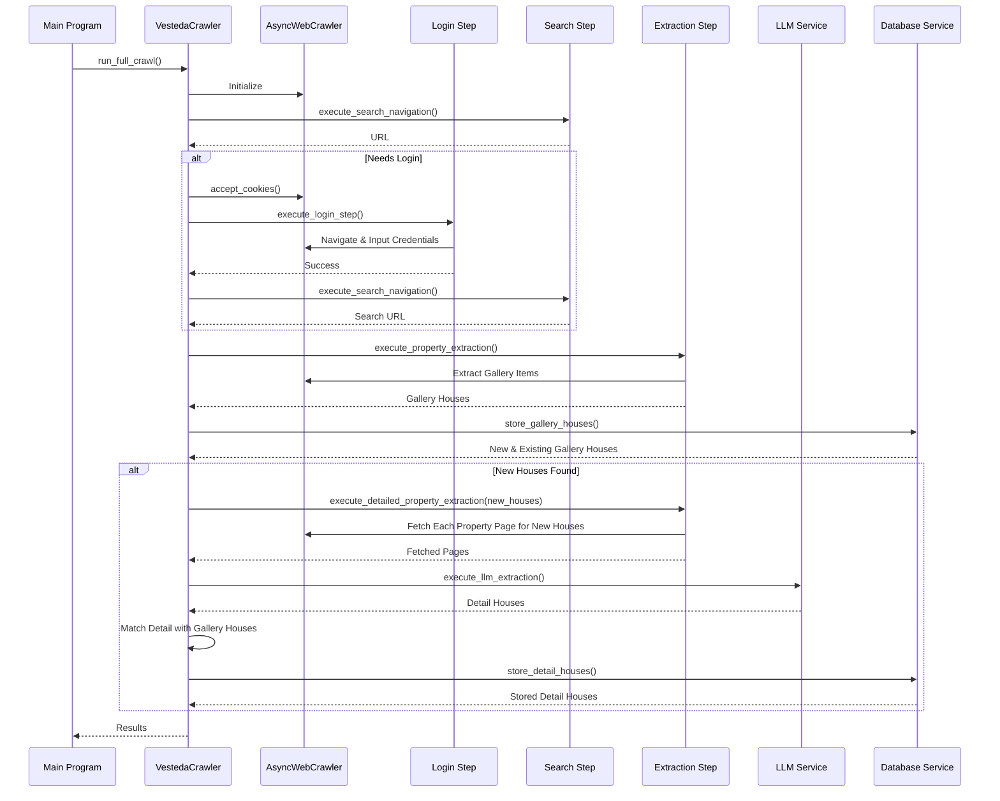

# StealHouse Architecture

## Crawler Flow

```mermaid
sequenceDiagram
    participant Main as Main Program
    participant Crawler as VestedaCrawler
    participant Browser as AsyncWebCrawler
    participant LoginStep as Login Step
    participant SearchStep as Search Step
    participant ExtractStep as Extraction Step
    participant LLM as LLM Service
    participant DB as Database Service
    
    Main ->> Crawler: run_full_crawl()
    Crawler ->> Browser: Initialize
    Crawler ->> SearchStep: execute_search_navigation()
    SearchStep -->> Crawler: URL
    
    alt Needs Login
        Crawler ->> Browser: accept_cookies()
        Crawler ->> LoginStep: execute_login_step()
        LoginStep ->> Browser: Navigate & Input Credentials
        LoginStep -->> Crawler: Success
        Crawler ->> SearchStep: execute_search_navigation()
        SearchStep -->> Crawler: Search URL
    end
    
    Crawler ->> ExtractStep: execute_property_extraction()
    ExtractStep ->> Browser: Extract Gallery Items
    ExtractStep -->> Crawler: Gallery Houses
    
    Crawler ->> DB: store_gallery_houses()
    DB -->> Crawler: New & Existing Gallery Houses
    
    alt New Houses Found
        Crawler ->> ExtractStep: execute_detailed_property_extraction(new_houses)
        ExtractStep ->> Browser: Fetch Each Property Page for New Houses
        ExtractStep -->> Crawler: Fetched Pages

        Crawler ->> LLM: execute_llm_extraction()
        LLM -->> Crawler: Detail Houses

        Crawler ->> Crawler: Match Detail with Gallery Houses
        Crawler ->> DB: store_detail_houses()
        DB -->> Crawler: Stored Detail Houses
    end
    
    Crawler -->> Main: Results
```

