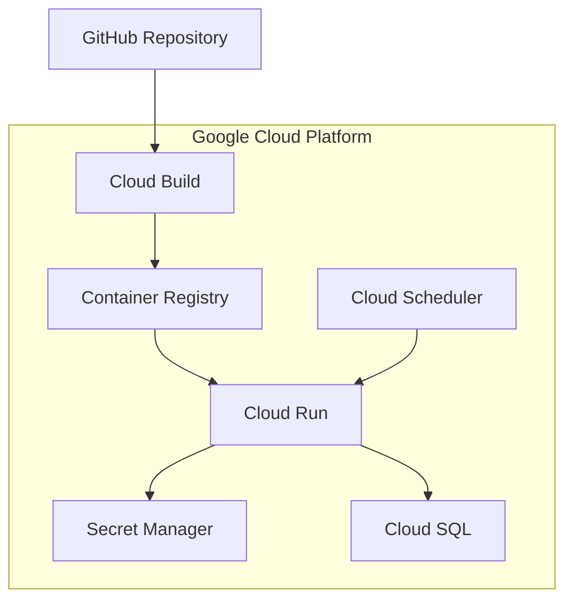

# StealHouse Cloud Deployment

## Overview

This document outlines the deployment of the StealHouse crawler system to Google Cloud. The system is containerized for easy deployment and scalability.

## Architecture



## Components

1. **Cloud Run**: Serverless compute platform to run the containerized crawler
2. **Cloud SQL**: Managed PostgreSQL database (alternative to the local Docker container)
3. **Secret Manager**: Secure storage for sensitive environment variables
4. **Cloud Scheduler**: Trigger crawler runs on a schedule
5. **Cloud Build**: CI/CD pipeline for automated deployment

## Deployment Options

### Option 1: Manual Deployment with `deploy-cloud-run.sh`

This approach uses a bash script to deploy the application directly from your local machine:

1. Set up Google Cloud CLI
2. Configure project and authentication
3. Update the `.env` file with your credentials
4. Run `./deploy-cloud-run.sh`

### Option 2: CI/CD with Cloud Build

This approach uses Google Cloud Build for automated deployment from GitHub:

1. Connect your GitHub repository to Cloud Build
2. Store secrets in Secret Manager
3. Configure service account permissions
4. Trigger builds automatically on push to main branch

## Environment Variables

The following environment variables are required for deployment:

| Variable | Description | Storage |
|----------|-------------|---------|
| POSTGRES_USER | Database username | Secret Manager |
| POSTGRES_PASSWORD | Database password | Secret Manager |
| POSTGRES_DB | Database name | Secret Manager |
| POSTGRES_HOST | Database host (Cloud SQL IP or connection name) | Secret Manager |
| POSTGRES_PORT | Database port (usually 5432) | Environment Variable |
| DEEPSEEK_API_KEY | DeepSeek API key | Secret Manager |
| GOOGLE_API_KEY | Google API key for Gemini | Secret Manager |
| VESTEDA_EMAIL | Vesteda login email | Secret Manager |
| VESTEDA_PASSWORD | Vesteda login password | Secret Manager |

## Database Options

### Option 1: Cloud SQL (Recommended for Production)

1. Create a Cloud SQL PostgreSQL instance
2. Configure networking and authentication
3. Initialize the database schema with Alembic

```bash
# Connect to Cloud SQL via proxy
cloud_sql_proxy -instances=PROJECT_ID:REGION:INSTANCE_NAME=tcp:5432

# Run migrations
alembic upgrade head
```

### Option 2: Connect to Existing Docker Container

1. Ensure your Docker container is accessible from the cloud
2. Configure network settings and firewall rules
3. Update connection parameters in environment variables

## Scheduled Execution

To run the crawler on a schedule using Cloud Scheduler:

1. Create a service account with invocation permissions
2. Create a new Cloud Scheduler job:
   ```
   gcloud scheduler jobs create http steal-house-crawler-job \
     --schedule="0 8 * * *" \
     --uri="https://REGION-run.googleapis.com/apis/run.googleapis.com/v1/namespaces/PROJECT_ID/jobs/steal-house-crawler:run" \
     --http-method=POST \
     --oauth-service-account-email=scheduler-sa@PROJECT_ID.iam.gserviceaccount.com
   ```

## Monitoring and Logs

- View logs in Cloud Logging
- Set up alerts for crawler failures
- Monitor resource usage in Cloud Monitoring

## Common Issues

1. **Puppeteer in Cloud Run**: Puppeteer requires specific dependencies installed in the container
2. **Database connectivity**: Ensure proper network configuration for database access
3. **Timeout issues**: Configure Cloud Run timeout settings appropriately for long-running crawler operations
4. **Memory usage**: Browser automation can be memory intensive, adjust resource allocation as needed 