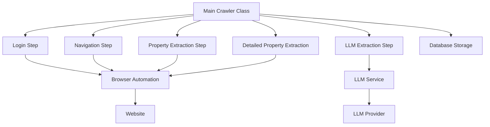

# StealHouse Crawler Documentation

## Overview

The StealHouse crawler system is built on top of the `crawl4ai` library, which provides browser automation capabilities through Puppeteer. The crawler is designed to be modular, with separate components for different housing websites.

## Crawler Architecture

Each website crawler follows a step-based architecture:



## Vesteda Crawler Implementation

The Vesteda crawler is structured as follows:

### Main Crawler Class (`VestedaCrawler`)

```python
class VestedaCrawler:
    def __init__(self):
        # Initialize configuration
        
    async def run_full_crawl(self):
        # Run complete crawl process
```

### Step Components

The crawler is divided into several steps:

1. **Login Step**: Handles authentication to the Vesteda portal
2. **Search Navigation Step**: Navigates to the property search page
3. **Property Extraction Step**: Extracts basic property data from the gallery view
4. **Detailed Property Extraction**: Extracts detailed information from individual property pages
5. **LLM Extraction Step**: Uses LLM to structure and enhance the extracted data

## Crawler Configuration

The crawler uses the following configuration:

```python
browser_config = BrowserConfig(
    user_data_dir="./browser_data/vesteda",  # Persistent profile directory
    headless=True,  # Run without visible browser
    verbose=True,  # For debugging
    use_managed_browser=True,  # For persistent sessions
)
```

## Error Handling

The crawler implements robust error handling:

- Each step includes try/except blocks to catch specific errors
- Errors are logged to both console and file (`vesteda_crawler.log`)
- Critical errors are raised to the main process

## Cookie Management

The crawler handles cookies for maintaining sessions:

```python
async def accept_cookies(crawler, url, session_id):
    # Cookie acceptance implementation
```

## Adding New Crawlers

To add a new housing website crawler:

1. Create a new directory under `python_scripts/crawlers/`
2. Implement the step components following the same pattern as Vesteda
3. Create a main crawler class that orchestrates the steps
4. Add any website-specific models under a models directory

## Crawler Output

The crawler generates two main types of data:

1. `GalleryHouse`: Basic information from the property listing page
2. `DetailHouse`: Comprehensive information from individual property pages

This data is then stored in the PostgreSQL database. 