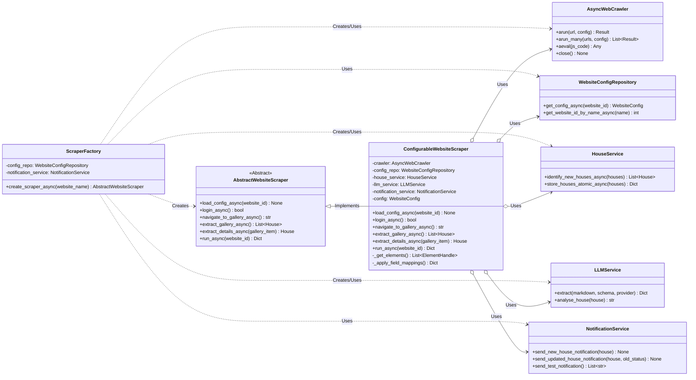

# StealHouse Crawler Architectuur

## 1. Introductie

Dit document beschrijft de architectuur van de StealHouse Crawler, een Python-applicatie ontworpen om vastgoedinformatie van verschillende websites te scrapen, te verwerken en op te slaan. De focus ligt op een configureerbare en uitbreidbare opzet, waarbij gebruik wordt gemaakt van moderne asynchrone programming patterns en externe libraries zoals `crawl4ai` en `SQLAlchemy`.

De architectuur is opgezet met principes als Separation of Concerns, Dependency Injection (impliciet), en het Repository pattern om onderhoudbaarheid, testbaarheid en schaalbaarheid te bevorderen.

**Kerntechnologieën:**

*   **Taal:** Python 3.x
*   **Asynchroon Framework:** `asyncio`
*   **Web Scraping/Browser Automatisering:** `crawl4ai` (bovenop Playwright)
*   **Database:** PostgreSQL (via `SQLAlchemy` async)
*   **Data Validatie/Modellering:** `Pydantic`
*   **Configuratie:** Omgevingsvariabelen (`dotenv`), Database (via SQLAlchemy/Pydantic)
*   **Notificaties:** E-mail, Pushover, Telegram
*   **LLM Integratie:** `litellm` (voor DeepSeek/Gemini)

## 2. Core Concepts

*   **Configuratie-gedreven Scraping:** De logica voor het navigeren en extraheren van data voor een specifieke website wordt grotendeels gedefinieerd in databaseconfiguratie (`steal_house.websites`, `login_configs`, etc.). Dit minimaliseert de noodzaak voor code-aanpassingen bij het toevoegen of wijzigen van ondersteunde websites.
*   **Asynchrone Verwerking:** De applicatie maakt intensief gebruik van `asyncio` om I/O-bound operaties (netwerk requests, database interacties, browser acties) efficiënt uit te voeren zonder de main thread te blokkeren.
*   **Gelaagde Architectuur:** De code is opgedeeld in logische lagen (presentatie/entrypoint, services, repositories, models) om de verantwoordelijkheden te scheiden.
*   **Abstractie van Scraping:** Een `AbstractWebsiteScraper` definieert een contract voor alle scrapers, terwijl `ConfigurableWebsiteScraper` een generieke implementatie biedt die de databaseconfiguratie gebruikt. Een `ScraperFactory` is verantwoordelijk voor het instantiëren van de juiste scraper.
*   **Model Scheiding:** Er wordt een duidelijk onderscheid gemaakt tussen Pydantic modellen (gebruikt binnen de applicatielogica en voor data validatie) en SQLAlchemy modellen (voor database interactie). `helpers/transformers.py` faciliteert de conversie.

## 3. High-Level Architectuur Overzicht

De applicatie volgt een gelaagde structuur:

1.  **Entry Point (`main.py`):** Verwerkt command-line argumenten, initialiseert logging en services, start de asynchrone `run_crawler_async` functie, en handelt de uiteindelijke exit status af.
2.  **Orchestration (`run_crawler_async` in `main.py`):** Coördineert het scraping proces:
    *   Haalt DB sessie en configuratie repository op.
    *   Initialiseert de `NotificationService`.
    *   Gebruikt de `ScraperFactory` om de juiste scraper te maken.
    *   Roept de `run_async` methode van de scraper aan.
    *   Logt de resultaten.
    *   Zorgt voor resource cleanup (DB sessie, browser).
3.  **Scraper Core (`crawlers` package):**
    *   `ScraperFactory`: Creëert scraper instanties.
    *   `AbstractWebsiteScraper`: Definieert het scraper interface.
    *   `ConfigurableWebsiteScraper`: Implementeert de scraper logica op basis van databaseconfiguratie, gebruikmakend van `crawl4ai` en services.
    *   `vesteda` (sub-package): Lijkt een oudere, specifiekere implementatie te bevatten, mogelijk als proof-of-concept of voor een complexere site. Deze gebruikt ook `crawl4ai` maar met meer hardcoded stappen.
4.  **Services (`services` package):** Bevat de business logica:
    *   `HouseService`: Logica voor het opslaan, ophalen en identificeren van nieuwe/gewijzigde huizen. Coördineert met `HouseRepository` en `NotificationService`.
    *   `LLMService`: Interface voor interactie met Large Language Models (Gemini, DeepSeek) voor data extractie of analyse.
    *   `NotificationService`: Beheert en verstuurt notificaties via geconfigureerde kanalen.
    *   `db_connection`: Beheert de SQLAlchemy async engine en sessies.
    *   `crawl4ai_repository`: Lijkt een alternatieve manier om `crawl4ai` aan te roepen via een externe API (mogelijk minder relevant als `crawl4ai` lokaal wordt gebruikt).
5.  **Repositories (`services/repositories` package):** Abstractielaag voor data toegang:
    *   `HouseRepository`: CRUD operaties voor `DbHouse` objecten.
    *   `WebsiteConfigRepository`: Laadt configuratie (`DbWebsite`, etc.) uit de database.
6.  **Data Models (`models` package):** Definieert datastructuren:
    *   `db_models.py`: SQLAlchemy ORM modellen voor de database tabellen (`DbHouse`).
    *   `house_models.py`: Pydantic modellen voor huizen (`House`, `FetchedPage`), gebruikt in de applicatielogica. Bevat conversie methoden (`to_db_model`, `from_db_model_async`, `from_dict`).
    *   `config_models.py`: SQLAlchemy en Pydantic modellen voor de website configuratie.
    *   `crawl4ai/models.py`: Pydantic-achtige klassen die de configuratie van `crawl4ai` representeren.
7.  **Notifications (`notifications` package):**
    *   `NotificationService`: Orchestreert notificaties.
    *   `channels`: Bevat de implementaties voor specifieke kanalen (Email, Pushover, Telegram), allen ervend van `AbstractNotificationChannel`.
8.  **Helpers (`helpers` package):**
    *   `transformers.py`: Functies voor het converteren tussen `DbHouse` (SQLAlchemy) en `House` (Pydantic) modellen.

## 4. Key Architectural Patterns

*   **Factory Pattern:** `ScraperFactory` creëert scraper objecten zonder de exacte klasse te specificeren in `main.py`.
*   **Strategy Pattern:** `ConfigurableWebsiteScraper` gebruikt verschillende extractie methoden (CSS, XPath, LLM) gebaseerd op de configuratie. De `NotificationService` gebruikt verschillende `AbstractNotificationChannel` implementaties.
*   **Repository Pattern:** `HouseRepository` en `WebsiteConfigRepository` scheiden de data access logica van de business logica (`HouseService`).
*   **Abstract Base Classes (ABC):** `AbstractWebsiteScraper` en `AbstractNotificationChannel` definiëren duidelijke interfaces voor implementaties.
*   **Asynchronous Programming:** `async/await` wordt gebruikt voor efficiënte I/O.
*   **Configuration Management:** Gebruik van `.env` voor secrets en database/API configuratie, en een database voor website-specifieke scraping logica.

## 5. Data Flow / Sequence Diagram (Standaard Crawl Proces)

Dit diagram toont de typische flow wanneer `main.py` wordt uitgevoerd voor een normale crawl (niet `--test-notifications-only`).

```mermaid
sequenceDiagram
    participant User/Scheduler as User
    participant main.py as Main
    participant ScraperFactory as Factory
    participant ConfigRepository as CfgRepo
    participant ConfigurableScraper as Scraper
    participant AsyncWebCrawler as Crawler
    participant HouseService as HouseSvc
    participant HouseRepository as HouseRepo
    participant LLMService as LLMSvc
    participant NotificationService as NotifSvc

    User->>Main: Start crawl (e.g., `python main.py --website Vesteda`)
    activate Main
    Main->>Main: Parse args, setup logging, load .env
    Main->>CfgRepo: __init__(db_session)
    Main->>NotifSvc: __init__()
    Main->>Factory: __init__(CfgRepo, NotifSvc)
    Main->>Factory: create_scraper_async("Vesteda")
    activate Factory
    Factory->>CfgRepo: get_website_id_by_name_async("Vesteda")
    activate CfgRepo
    CfgRepo-->>Factory: website_id
    deactivate CfgRepo
    Factory->>Crawler: __init__(BrowserConfig)
    Factory->>HouseSvc: __init__(NotifSvc)
    Factory->>LLMSvc: __init__()
    Factory->>Scraper: __init__(Crawler, CfgRepo, HouseSvc, LLMSvc, NotifSvc)
    Factory-->>Main: scraper_instance
    deactivate Factory

    Main->>Scraper: run_async(website_id)
    activate Scraper
    Scraper->>CfgRepo: get_config_async(website_id)
    activate CfgRepo
    CfgRepo-->>Scraper: website_config
    deactivate CfgRepo
    Scraper->>Scraper: load_config_async()
    Scraper->>Scraper: login_async() # Optional, based on config
    activate Crawler # Browser interaction starts
    Scraper->>Crawler: arun() / aeval() for login steps
    Crawler-->>Scraper: Login result
    Scraper->>Scraper: navigate_to_gallery_async()
    Scraper->>Crawler: arun() / aeval() for navigation
    Crawler-->>Scraper: Gallery page URL/state
    Scraper->>Scraper: extract_gallery_async()
    Scraper->>Crawler: aeval() / _get_elements() / LLMSvc.extract()
    Crawler-->>Scraper: Gallery data (basic house info)
    Scraper-->>Main: List[House] (basic info)
    deactivate Crawler # Browser interaction temporarily paused

    Scraper->>HouseSvc: identify_new_houses_async(houses)
    activate HouseSvc
    HouseSvc->>HouseRepo: get_by_address(addr, city) # Loop
    activate HouseRepo
    HouseRepo-->>HouseSvc: Existing house or None
    deactivate HouseRepo
    HouseSvc-->>Scraper: List[House] (new_houses)
    deactivate HouseSvc

    alt New houses found
        Scraper->>Scraper: Loop through new_houses
        Scraper->>Scraper: extract_details_async(house)
        activate Crawler # Browser interaction resumes
        Scraper->>Crawler: arun(detail_url)
        Crawler-->>Scraper: Detail page state
        Scraper->>Crawler: aeval() / _apply_field_mappings() / LLMSvc.extract() # Detail extraction
        Crawler-->>Scraper: Detailed house data
        deactivate Crawler
        Scraper->>Scraper: Merge details into main house list
        Scraper->>Scraper: End loop
    end

    Scraper->>HouseSvc: store_houses_atomic_async(all_houses)
    activate HouseSvc
    HouseSvc->>HouseRepo: Begin transaction
    activate HouseRepo
    HouseSvc->>HouseRepo: get_by_address() / create() / update() # Loop
    HouseRepo-->>HouseSvc: DB results
    alt Notifications enabled and new/updated houses
        HouseSvc->>NotifSvc: send_new_house_notification(house) / send_updated_house_notification(house, old_status)
        activate NotifSvc
        NotifSvc->>NotifSvc: Send via active channels (Email, Pushover, etc.)
        NotifSvc-->>HouseSvc: Send results
        deactivate NotifSvc
    end
    HouseSvc->>HouseRepo: Commit transaction
    deactivate HouseRepo
    HouseSvc-->>Scraper: Store result (counts)
    deactivate HouseSvc

    Scraper-->>Main: Final result dictionary
    deactivate Scraper

    Main->>Main: Log results
    Main->>Scraper: Close browser (scraper.crawler.close())
    Main->>Main: Close DB session
    Main-->>User: Exit code (0 or 1)
    deactivate Main

```

## 6. Class Diagram (Scraper Core & Dependencies)

Dit diagram toont de relaties tussen de scraper klassen en hun belangrijkste afhankelijkheden.



## 7. Configuratie

*   **Omgevingsvariabelen (.env):** Gebruikt voor secrets (database credentials, API keys, notificatie tokens), database connectie details, en globale instellingen (bv. `NOTIFICATION_CHANNELS_ACTIVE`, `CRAWLER_WEBSITE`, `TEST_NOTIFICATIONS_ONLY`).
*   **Database Configuratie:** De `steal_house` schema tabellen (`websites`, `login_configs`, `navigation_configs`, `extraction_configs`, `field_mappings`) definiëren de specifieke stappen en selectors voor elke website. Dit wordt geladen via `WebsiteConfigRepository` in `WebsiteConfig` Pydantic modellen.

## 8. Error Handling & Logging

*   **Logging:** Uitgebreide logging wordt gebruikt in de hele applicatie (`logging` module) naar zowel console als een logbestand (`steal_house_crawler.log` of `vesteda_crawler.log`). Log levels en formattering zijn geconfigureerd. ANSI kleurcodes worden gebruikt voor betere leesbaarheid in de console.
*   **Exceptions:** `try...except` blokken worden gebruikt om fouten op te vangen tijdens kritieke operaties (DB interactie, web scraping, API calls). Fouten worden gelogd, en in `main.py` wordt een non-zero exit code teruggegeven bij falen. Specifieke exceptions (bv. `ValueError` voor ontbrekende config, `SQLAlchemyError`) worden waar mogelijk gebruikt.

## 9. Potentiële Verbeteringen / Overwegingen

*   **Test Strategie:** Er zijn geen unit- of integratietests zichtbaar. Het toevoegen hiervan (met mocks voor externe services zoals `crawl4ai`, DB, LLM, Notificaties) zou de robuustheid verhogen.
*   **Dependency Injection Framework:** Hoewel DI principes worden toegepast, zou een formeel framework (zoals `python-dependency-injector`) het beheer van dependencies kunnen vereenvoudigen, vooral als de applicatie groeit.
*   **Schaalbaarheid:** Voor het scrapen van veel websites of zeer grote websites, zou de huidige aanpak (één proces per crawl) kunnen limiteren. Overwegingen:
    *   Een job queue systeem (Celery, RQ, Dramatiq) om crawls te distribueren over meerdere workers.
    *   Containerisatie (Docker) en orchestratie (Kubernetes) voor deployment en schaling.
*   **Monitoring:** Implementeer monitoring (bv. met Prometheus/Grafana) om de status van crawls, error rates, en resource gebruik bij te houden.
*   **Security:** Zorg ervoor dat secrets (API keys, wachtwoorden) veilig worden beheerd (bv. via environment variables, secrets manager) en niet in de code of configuratie database terechtkomen.
*   **`vesteda` vs `Configurable`:** De aanwezigheid van de specifieke `vesteda` crawler naast de `ConfigurableWebsiteScraper` suggereert mogelijke redundantie of een transitiefase. Idealiter zou de `vesteda` logica volledig gemigreerd worden naar de configureerbare aanpak, tenzij er zeer specifieke, niet-generaliseerbare logica nodig is.
*   **Synchrone Wrappers:** De synchrone wrappers in `AbstractWebsiteScraper` en `ScraperFactory` lijken bedoeld voor backward compatibility maar kunnen verwarrend zijn in een overwegend asynchrone codebase. Overweeg deze te verwijderen als ze niet strikt noodzakelijk zijn.

## 10. Conclusie

De StealHouse Crawler heeft een solide, modulaire architectuur die is ontworpen voor configureerbaarheid en onderhoudbaarheid. Het gebruik van `asyncio`, duidelijke laag-scheiding, abstracties (ABC's, Repositories), en Pydantic/SQLAlchemy voor modellering zijn sterke punten. De configuratie-gedreven aanpak maakt het relatief eenvoudig om ondersteuning voor nieuwe websites toe te voegen. Aandachtspunten voor de toekomst zijn onder andere het implementeren van een robuuste teststrategie en het overwegen van schaalbaarheidsoplossingen als de applicatie groeit.
