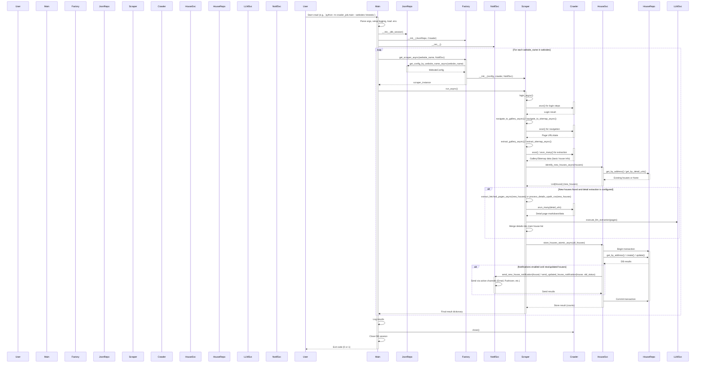
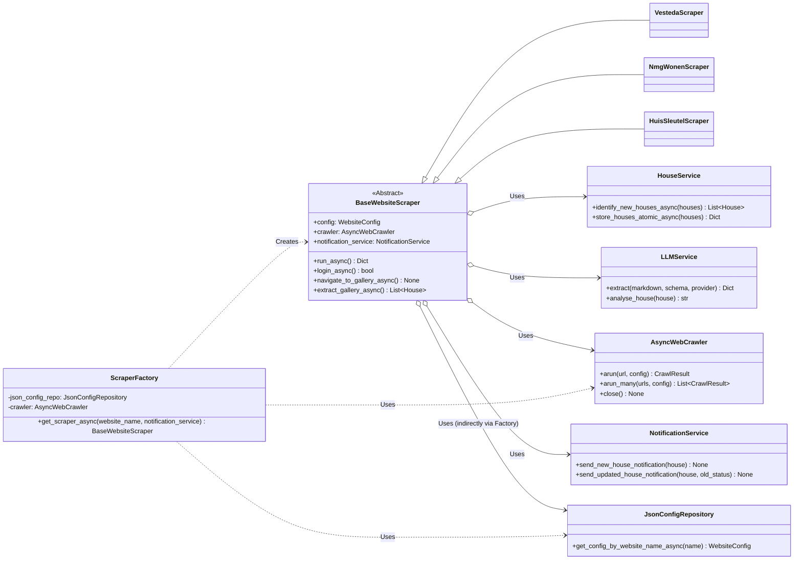

# StealHouse Crawler Architectuur

## 1. Introductie

Dit document beschrijft de architectuur van de StealHouse Crawler, een Python-applicatie ontworpen om vastgoedinformatie van verschillende websites te scrapen, te verwerken en op te slaan. De focus ligt op een configureerbare en uitbreidbare opzet, waarbij gebruik wordt gemaakt van moderne asynchrone programming patterns en externe libraries zoals `crawl4ai` en `SQLAlchemy`.

De architectuur is opgezet met principes als Separation of Concerns, Dependency Injection (impliciet), en het Repository pattern om onderhoudbaarheid, testbaarheid en schaalbaarheid te bevorderen.

**Kerntechnologieën:**

*   **Taal:** Python 3.x
*   **Asynchroon Framework:** `asyncio`
*   **Web Scraping/Browser Automatisering:** `crawl4ai` (bovenop Playwright)
*   **Database:** PostgreSQL (via `SQLAlchemy` async)
*   **Data Validatie/Modellering:** `Pydantic`
*   **Configuratie:** Omgevingsvariabelen (`dotenv`), Database (via SQLAlchemy/Pydantic)
*   **Notificaties:** E-mail, Pushover, Telegram
*   **LLM Integratie:** `litellm` (voor DeepSeek/Gemini)

## 2. Core Concepts

*   **Configuratie-gedreven Scraping:** De logica voor het navigeren en extraheren van data voor een specifieke website wordt grotendeels gedefinieerd in databaseconfiguratie (`steal_house.websites`, `login_configs`, etc.). Dit minimaliseert de noodzaak voor code-aanpassingen bij het toevoegen of wijzigen van ondersteunde websites.
*   **Asynchrone Verwerking:** De applicatie maakt intensief gebruik van `asyncio` om I/O-bound operaties (netwerk requests, database interacties, browser acties) efficiënt uit te voeren zonder de main thread te blokkeren.
*   **Gelaagde Architectuur:** De code is opgedeeld in logische lagen (presentatie/entrypoint, services, repositories, models) om de verantwoordelijkheden te scheiden.
*   **Abstractie van Scraping:** Een `AbstractWebsiteScraper` definieert een contract voor alle scrapers, terwijl `ConfigurableWebsiteScraper` een generieke implementatie biedt die de databaseconfiguratie gebruikt. Een `ScraperFactory` is verantwoordelijk voor het instantiëren van de juiste scraper.
*   **Model Scheiding:** Er wordt een duidelijk onderscheid gemaakt tussen Pydantic modellen (gebruikt binnen de applicatielogica en voor data validatie) en SQLAlchemy modellen (voor database interactie). `helpers/transformers.py` faciliteert de conversie.

## 3. High-Level Architectuur Overzicht

De applicatie volgt een gelaagde structuur:

1.  **Entry Point (`main.py`):** Verwerkt command-line argumenten, initialiseert logging en services, start de asynchrone `run_crawler_async` functie, en handelt de uiteindelijke exit status af.
2.  **Orchestration (`run_crawler_async` in `main.py`):** Coördineert het scraping proces:
    *   Haalt DB sessie en configuratie repository op.
    *   Initialiseert de `NotificationService`.
    *   Gebruikt de `ScraperFactory` om de juiste scraper te maken.
    *   Roept de `run_async` methode van de scraper aan.
    *   Logt de resultaten.
    *   Zorgt voor resource cleanup (DB sessie, browser).
3.  **Scraper Core (`flexibleCrawlers` en `crawlers` packages):**
    *   `ScraperFactory`: Creëert scraper instanties op basis van de website naam.
    *   `flexibleCrawlers/base_scraper.py`: Bevat `BaseWebsiteScraper`, de abstracte basisklasse die de generieke scrape-flow implementeert.
    *   `flexibleCrawlers/*_scraper.py`: Specifieke scraper-implementaties (bv. `VestedaScraper`, `NmgWonenScraper`) die erven van `BaseWebsiteScraper` en site-specifieke logica kunnen overschrijven.
    *   `crawlers` (package): Bevat een **oudere, legacy** implementatie voor Vesteda en wordt niet meer actief gebruikt.
4.  **Services (`services` package):** Bevat de business logica:
    *   `HouseService`: Logica voor het opslaan, ophalen en identificeren van nieuwe/gewijzigde huizen. Coördineert met `HouseRepository` en `NotificationService`.
    *   `LLMService`: Interface voor interactie met Large Language Models (Gemini, DeepSeek) voor data extractie of analyse.
    *   `NotificationService`: Beheert en verstuurt notificaties via geconfigureerde kanalen.
    *   `db_connection`: Beheert de SQLAlchemy async engine en sessies.
    *   `crawl4ai_repository`: Lijkt een alternatieve manier om `crawl4ai` aan te roepen via een externe API (mogelijk minder relevant als `crawl4ai` lokaal wordt gebruikt).
5.  **Repositories (`services/repositories` package):** Abstractielaag voor data toegang:
    *   `HouseRepository`: CRUD operaties voor `DbHouse` objecten.
    *   `WebsiteConfigRepository`: Laadt configuratie (`DbWebsite`, etc.) uit de database.
6.  **Data Models (`models` package):** Definieert datastructuren:
    *   `db_models.py`: SQLAlchemy ORM modellen voor de database tabellen (`DbHouse`).
    *   `house_models.py`: Pydantic modellen voor huizen (`House`, `FetchedPage`), gebruikt in de applicatielogica. Bevat conversie methoden (`to_db_model`, `from_db_model_async`, `from_dict`).
    *   `config_models.py`: SQLAlchemy en Pydantic modellen voor de website configuratie.
    *   `crawl4ai/models.py`: Pydantic-achtige klassen die de configuratie van `crawl4ai` representeren.
7.  **Notifications (`notifications` package):**
    *   `NotificationService`: Orchestreert notificaties.
    *   `channels`: Bevat de implementaties voor specifieke kanalen (Email, Pushover, Telegram), allen ervend van `AbstractNotificationChannel`.
8.  **Helpers (`helpers` package):**
    *   `transformers.py`: Functies voor het converteren tussen `DbHouse` (SQLAlchemy) en `House` (Pydantic) modellen.

## 4. Key Architectural Patterns

*   **Factory Pattern:** `ScraperFactory` creëert scraper objecten (`BaseWebsiteScraper` subklassen) zonder dat de aanroeper (`main.py`) de exacte klasse hoeft te kennen.
*   **Strategy Pattern:** De `BaseWebsiteScraper` definieert een algemeen scraping-algoritme, terwijl subklassen (zoals `VestedaScraper`) specifieke stappen van dat algoritme kunnen overschrijven. De `NotificationService` gebruikt ook verschillende `AbstractNotificationChannel` implementaties als strategieën.
*   **Repository Pattern:** `HouseRepository` en `JsonConfigRepository` scheiden de data access logica van de business logica (`HouseService`).
*   **Abstract Base Classes (ABC):** `BaseWebsiteScraper` en `AbstractNotificationChannel` definiëren duidelijke interfaces voor implementaties.
*   **Asynchronous Programming:** `async/await` wordt gebruikt voor efficiënte I/O.
*   **Configuration Management:** Gebruik van `.env` voor secrets en een database-opgeslagen JSON (`website_scrape_configs`) voor website-specifieke scraping logica.

## 5. Data Flow / Sequence Diagram (Standaard Crawl Proces)

Dit diagram toont de typische flow wanneer `main.py` wordt uitgevoerd voor een normale crawl (niet `--test-notifications-only`).

## 6. Class Diagram (Scraper Core & Dependencies)

Dit diagram toont de relaties tussen de scraper klassen en hun belangrijkste afhankelijkheden.

## 7. Configuratie

*   **Omgevingsvariabelen (.env):** Gebruikt voor secrets (database credentials, API keys, notificatie tokens), en globale instellingen (bv. `NOTIFICATION_CHANNELS_ACTIVE`, `CRAWLER_WEBSITES`, `DEBUG_MODE`).
*   **Database JSON Configuratie:** De `website_scrape_configs` tabel bevat een JSON-object dat de *declaratieve* aspecten van een scraper definieert (selectors, URLs, etc.). Dit wordt geladen via `JsonConfigRepository` in `WebsiteConfig` Pydantic modellen. De *procedurele* logica en runtime configuratie (zoals `CrawlerRunConfig`) bevinden zich in de Python scraper klassen.

## 8. Error Handling & Logging

*   **Logging:** Uitgebreide logging wordt gebruikt in de hele applicatie (`logging` module) naar zowel console als een logbestand (`steal_house_crawler.log` of `vesteda_crawler.log`). Log levels en formattering zijn geconfigureerd. ANSI kleurcodes worden gebruikt voor betere leesbaarheid in de console.
*   **Exceptions:** `try...except` blokken worden gebruikt om fouten op te vangen tijdens kritieke operaties (DB interactie, web scraping, API calls). Fouten worden gelogd, en in `main.py` wordt een non-zero exit code teruggegeven bij falen. Specifieke exceptions (bv. `ValueError` voor ontbrekende config, `SQLAlchemyError`) worden waar mogelijk gebruikt.

## 9. Potentiële Verbeteringen / Overwegingen

*   **Test Strategie:** Er zijn geen unit- of integratietests zichtbaar. Het toevoegen hiervan (met mocks voor externe services zoals `crawl4ai`, DB, LLM, Notificaties) zou de robuustheid aanzienlijk verhogen.
*   **Dependency Injection Framework:** Hoewel DI principes worden toegepast, zou een formeel framework (zoals `python-dependency-injector`) het beheer van dependencies kunnen vereenvoudigen, vooral als de applicatie groeit.
*   **Schaalbaarheid:** Voor het scrapen van veel websites tegelijk, zou de huidige aanpak (sequentieel per website in `main.py`) kunnen limiteren. Overwegingen:
    *   Parallellisatie van de loop in `main.py` met `asyncio.gather` om meerdere scrapers tegelijk te laten draaien.
    *   Een job queue systeem (Celery, RQ) voor distributie over meerdere workers.
*   **Monitoring:** Implementeer monitoring (bv. met Prometheus/Grafana) om de status van crawls, error rates, en resource gebruik bij te houden.

## 10. Conclusie

De StealHouse Crawler heeft een solide, modulaire architectuur die is ontworpen voor configureerbaarheid en onderhoudbaarheid. Het gebruik van `asyncio`, duidelijke laag-scheiding, abstracties (ABC's, Repositories), en Pydantic/SQLAlchemy voor modellering zijn sterke punten. De configuratie-gedreven aanpak maakt het relatief eenvoudig om ondersteuning voor nieuwe websites toe te voegen. Aandachtspunten voor de toekomst zijn onder andere het implementeren van een robuuste teststrategie en het overwegen van schaalbaarheidsoplossingen als de applicatie groeit.
