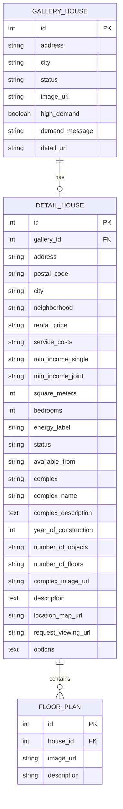

# StealHouse Database Documentation

## Overview

StealHouse uses a PostgreSQL database to store all housing data. The database is containerized using Docker and accessed through SQLAlchemy ORM.

## Database Schema

The database uses a schema named `steal_house` and contains the following tables:



## Database Connection

The database connection is managed by `db_connection.py`:

```python
from sqlalchemy import create_engine
from sqlalchemy.ext.declarative import declarative_base
from sqlalchemy.orm import sessionmaker
import os
from dotenv import load_dotenv

# Connection string built from environment variables
connection_string = f"postgresql://{user}:{password}@{host}:{port}/{database}"
```

## Data Models

The SQLAlchemy models representing the database tables are defined in `models.py`:

### GalleryHouse
Basic property information from the gallery view.

### DetailHouse
Comprehensive property information including financial details, features, and more.

### FloorPlan
Floor plan images and descriptions for a property.

## Repositories

Data access is handled through repository classes that abstract database operations:

```python
class BaseRepository:
    # Common repository operations

class GalleryHouseRepository(BaseRepository):
    # Gallery house specific operations

class DetailHouseRepository(BaseRepository):
    # Detail house specific operations

class FloorPlanRepository(BaseRepository):
    # Floor plan specific operations
```

## Database Operations

The main operations performed on the database are:

1. **Create/Update Gallery Houses**: Store basic property data from the gallery view
2. **Create/Update Detail Houses**: Store comprehensive property data from detail pages
3. **Create Floor Plans**: Store floor plan images and descriptions
4. **Query Properties**: Retrieve properties based on various criteria

## Database Setup

The database is set up using Docker Compose:

```yaml
# docker-compose.yml
services:
  db:
    image: postgres:latest
    environment:
      POSTGRES_USER: ${POSTGRES_USER}
      POSTGRES_PASSWORD: ${POSTGRES_PASSWORD}
      POSTGRES_DB: ${POSTGRES_DB}
    ports:
      - "${POSTGRES_PORT}:5432"
    volumes:
      - postgres_data:/var/lib/postgresql/data
```

## Schema Migrations

Database schema migrations are managed using Alembic:

```bash
# Generate migration
alembic revision --autogenerate -m "Description"

# Apply migration
alembic upgrade head
```

## Environment Configuration

Database connection parameters are stored in `.env`:

```
POSTGRES_USER=username
POSTGRES_PASSWORD=password
POSTGRES_DB=database_name
POSTGRES_PORT=5432
POSTGRES_HOST=localhost
``` 