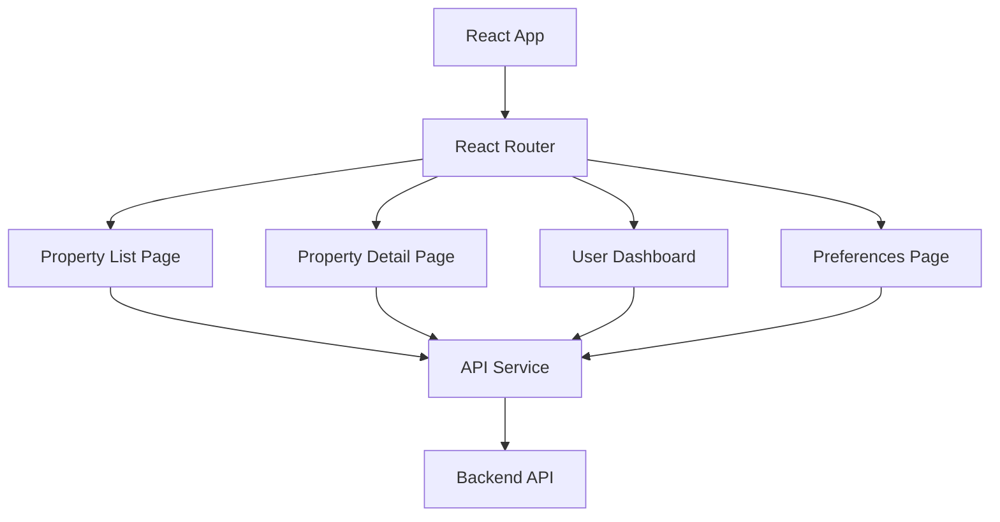
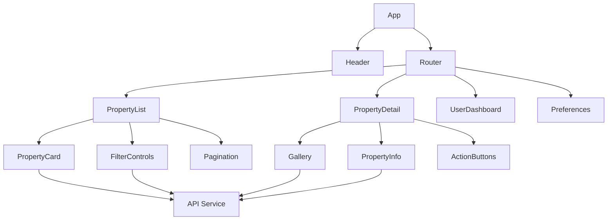

# StealHouse Frontend Plan

## Current Status

The frontend is in the early planning stages. The project has been initialized with React + Vite and will be developed to display property data from the database.

## Planned Architecture



## Component Structure



## Planned Features

1. **Property Listing Page**
   - Filter by location, price, size, amenities
   - Sort by relevance, price, availability date
   - Paginated results
   - Quick view of key property details

2. **Property Detail Page**
   - Image gallery with floor plans
   - Detailed property information
   - Neighborhood information
   - Application/contact options
   - Relevance score based on user preferences

3. **User Dashboard**
   - Saved properties
   - Application status
   - Notifications for new relevant properties
   - Recently viewed properties

4. **Preferences Page**
   - Location preferences
   - Price range
   - Must-have features
   - Nice-to-have features
   - Availability timeline

## Technical Stack

- **Framework**: React
- **Build Tool**: Vite
- **Styling**: CSS Modules or Tailwind CSS
- **State Management**: React Context or Redux
- **API Communication**: Fetch or Axios

## User Experience Goals

1. **Fast and Responsive**
   - Quick loading times
   - Responsive design for all devices
   - Optimized image loading

2. **Intuitive Interface**
   - Clear navigation
   - Consistent design language
   - Helpful feedback and tooltips

3. **Personalized Experience**
   - Property recommendations based on preferences
   - Saved searches and filters
   - Notification system for new matches

## Implementation Timeline

1. **Phase 1**: Basic property listing and detail views
2. **Phase 2**: User accounts and preferences
3. **Phase 3**: Personalized recommendations and notifications
4. **Phase 4**: Application submission and tracking

## API Integration

The frontend will communicate with the backend through a RESTful API:

```
GET /api/properties - List all properties with filters
GET /api/properties/:id - Get property details
POST /api/users/preferences - Save user preferences
GET /api/users/recommendations - Get personalized recommendations
``` 