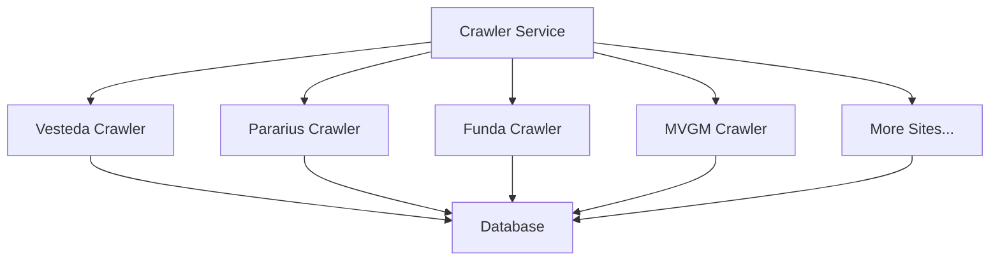
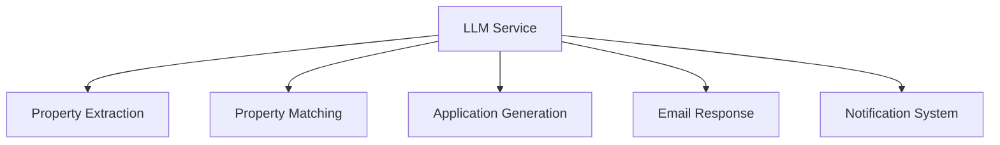
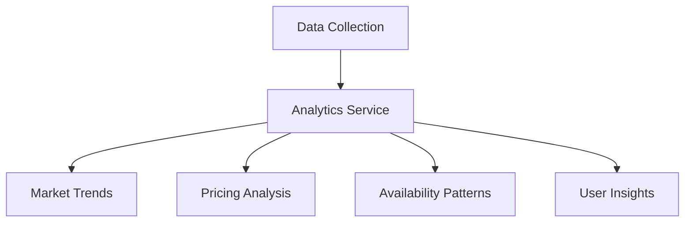

# StealHouse Future Features

## Overview

This document outlines the planned future features for the StealHouse project. These features will expand the system's capabilities beyond the current Vesteda crawler implementation.

## Additional Housing Website Crawlers

1. **Pararius**: Major rental platform in the Netherlands
2. **Funda**: Property sales and rentals
3. **MVGM**: Property management company with rental listings
4. **Housing Anywhere**: International platform for medium to long-term rentals
5. **Kamernet**: Student housing and room rentals

## Advanced LLM Integration

1. **Property Relevance Matching**:
   - Use LLM to analyze property details against user preferences
   - Generate a relevance score for each property
   - Provide explanations for why a property matches user criteria

2. **Automated Application Generation**:
   - Generate personalized application/motivation letters
   - Tailor content based on property details and user profile
   - Follow appropriate formal tone and structure

3. **Email Response Analysis**:
   - Parse and interpret emails from housing providers
   - Extract key information (viewing dates, required documents)
   - Suggest appropriate responses

## User Notification System

1. **Real-time Property Alerts**:
   - Notify users when new properties matching their criteria are found
   - Alert for price changes or status updates on saved properties
   - Priority notifications for highly relevant properties

2. **Application Status Tracking**:
   - Track submitted applications
   - Parse email responses to update application status
   - Remind users of upcoming viewings or response deadlines

## Analytics and Insights

1. **Market Trend Analysis**:
   - Track changes in rental prices over time
   - Identify neighborhood popularity trends
   - Seasonal availability patterns

2. **User Behavior Insights**:
   - Analyze which properties receive the most interest
   - Understand changing user preferences
   - Optimize crawler priorities based on user activity

## Integration with External Services

1. **Map Services**:
   - Show properties on interactive maps
   - Display nearby amenities (public transport, shops, parks)
   - Commute time calculations

2. **Public Transport APIs**:
   - Calculate commute times to user-specified locations
   - Show nearby transit options
   - Integrate with journey planners

3. **Neighborhood Data**:
   - Crime statistics
   - School ratings
   - Noise levels
   - Air quality

## Admin Dashboard

1. **Crawler Management**:
   - Monitor crawler status and performance
   - View error logs and debugging information
   - Schedule and prioritize crawl operations

2. **User Management**:
   - View and manage user accounts
   - Monitor system usage
   - Handle subscription status

## Mobile Application

1. **Property Browsing**:
   - Browse properties on mobile devices
   - Receive push notifications
   - Save properties for later viewing

2. **On-the-go Applications**:
   - Submit applications from mobile
   - Upload documents using camera
   - Track application status 