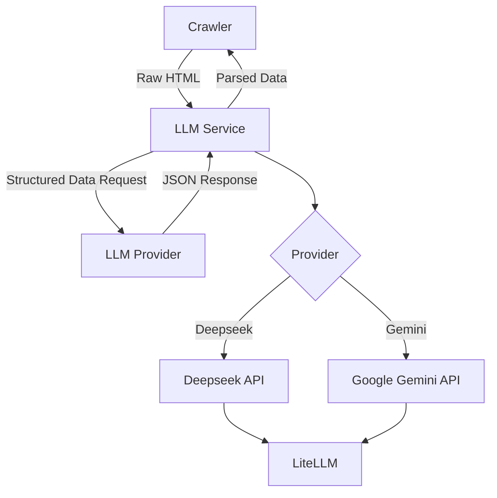

# StealHouse LLM Integration

## Overview

StealHouse uses Large Language Models (LLMs) to extract structured data from raw HTML content. This enables the system to intelligently parse housing information even when websites change their structure.

## LLM Providers

The system supports multiple LLM providers through the `LLMProvider` enum:

```python
class LLMProvider(Enum):
    DEEPSEEK = "deepseek"
    GEMINI = "gemini"
```

## Service Architecture



## LLM Service Implementation

The LLM service uses the `litellm` library to provide a consistent interface to different LLM providers:

```python
class LLMService:
    def __init__(self):
        self.deepseek_api_key = os.getenv("DEEPSEEK_API_KEY")
        self.google_api_key = os.getenv("GOOGLE_API_KEY")
        
    async def extract(self, markdown: str, schema: Dict[str, Any], provider: LLMProvider) -> Optional[Dict[str, Any]]:
        # Extract structured data using the specified LLM provider
```

## Data Extraction Schema

The system uses a predefined schema to guide the LLM in extracting the correct data:

```python
schema = {
    "type": "object",
    "properties": {
        "address": {"type": "string"},
        "postal_code": {"type": "string"},
        "city": {"type": "string"},
        # Additional properties...
    },
    "required": ["address", "city", "rental_price", "square_meters", "bedrooms"]
}
```

## Flow of Execution

1. The crawler fetches raw HTML from a property detail page
2. The HTML is passed to the LLM service
3. The LLM service constructs a prompt with the schema and HTML
4. The prompt is sent to the selected LLM provider
5. The LLM extracts structured data according to the schema
6. The response is parsed and returned as a Python dictionary
7. The structured data is saved to the database

## Example Usage

```python
# In the crawler
llm_service = LLMService()
schema = {
    # Property schema definition
}

detail_houses = await execute_llm_extraction(
    fetched_pages, 
    provider=LLMProvider.GEMINI
)
```

## Error Handling

The LLM service includes error handling for cases where the extraction fails:

- The service attempts to clean and normalize the LLM response
- If parsing fails, it returns None instead of raising an exception
- Errors are logged for debugging purposes

## Environment Configuration

LLM API keys are stored in the `.env` file:

```
DEEPSEEK_API_KEY=your_deepseek_api_key
GOOGLE_API_KEY=your_google_api_key
``` 