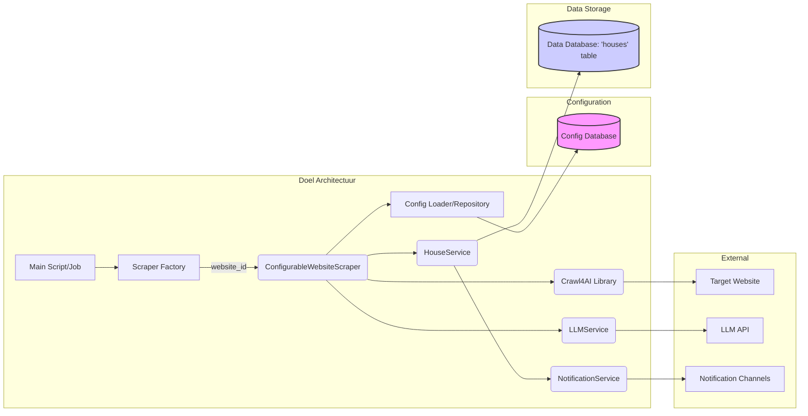

# Implementatieplan: Generieke Scrapingstructuur voor Woningwebsites (Bijgewerkt)

**Doel:** Refactor de bestaande Python scraping-applicatie (momenteel gericht op Vesteda) om een flexibele, configureerbare en uitbreidbare architectuur te creëren die meerdere woningwebsites kan ondersteunen met minimale code-aanpassingen.

**Kernprincipes:**

1.  **Configuration over Code:** Website-specifieke details (selectors, URLs, logica) worden opgeslagen in een database en dynamisch geladen.
2.  **Abstraction:** Gebruik abstracte klassen om de kern-scrapingflow te definiëren.
3.  **Modularity:** Splits het proces op in logische, herbruikbare componenten (Login, Navigatie, Extractie).
4.  **Extensibility (Open/Closed Principle):** Nieuwe websites toevoegen door configuratie (en eventueel een nieuwe concrete klasse) toe te voegen, zonder de kernlogica aan te passen.
5.  **Maintainability:** Gebruik type hints, SOLID-principes en duidelijke naamgeving.

---

### 1. Overzicht van de Huidige & Gewenste Architectuur

**Huidige Status (Basis):**

*   **Vesteda-Specifieke Crawler:** De `crawler_job` module bevat een `VestedaCrawler` (in `vesteda_crawler.py`) die specifieke stappen (`vesteda_steps/`) orkestreert voor de Vesteda website.
*   **Core Library:** Gebruikt `crawl4ai` voor browserautomatisering en interactie.
*   **Unified Data Model:** Gebruikt een enkele `House` Pydantic model (`house_models.py`) en een corresponderende `DbHouse` SQLAlchemy model (`db_models.py`) die data opslaat in een unified `steal_house.houses` tabel (bevestigd door migratie `refactor_house_models.py`).
*   **Services:** Bevat een `HouseService` voor database-interactie via `HouseRepository`, een `LLMService` voor data-extractie (reeds geïntegreerd in de Vesteda flow), en een `NotificationService`.
*   **Database:** PostgreSQL met een schema beheerd door Alembic, momenteel met alleen de `houses` tabel.

**Gewenste Architectuur (Doel):**

De doelarchitectuur blijft zoals oorspronkelijk gepland, gericht op generalisatie:

1.  **Configuratie Database:** PostgreSQL met *toegevoegde* tabellen voor website-specifieke configuraties.
2.  **Configuratie Lader:** Een `WebsiteConfigRepository` om configuratie te laden.
3.  **Abstracte Scraper (`AbstractWebsiteScraper`):** Definieert de scraping-interface.
4.  **Concrete Scraper (`ConfigurableWebsiteScraper`):** Implementeert de interface op basis van de geladen configuratie.
5.  **Scraper Factory:** Creëert de juiste scraper instantie.
6.  **Core Scraping Library (`crawl4ai`):** Blijft de basis voor browserautomatisering.
7.  **Data Models:** Het bestaande `House` Pydantic model wordt behouden.
8.  **Database Models:** De bestaande `DbHouse` wordt behouden; *nieuwe* modellen voor configuratietabellen worden toegevoegd.
9.  **Service Layer:** De bestaande `HouseService`, `LLMService` en `NotificationService` worden behouden en geïntegreerd in de generieke flow.



---

### 2. Gedetailleerd Databaseontwerp (Configuratie Schema Toevoegen)

De bestaande `steal_house.houses` tabel (model `DbHouse`) blijft ongewijzigd voor de opgeslagen woningdata. We moeten de volgende *nieuwe* tabellen toevoegen aan het `steal_house` schema voor de configuratie:

**Nieuwe Tabellen (zoals oorspronkelijk gepland):**

1.  **`websites`**
    *   `id`: `SERIAL PRIMARY KEY`
    *   `name`: `VARCHAR(100) NOT NULL UNIQUE` (bv. 'Vesteda', 'Pararius')
    *   `base_url`: `VARCHAR(255) NOT NULL`
    *   `is_active`: `BOOLEAN DEFAULT TRUE`
    *   `description`: `TEXT NULLABLE`
    *   `created_at`: `TIMESTAMP DEFAULT CURRENT_TIMESTAMP`
    *   `updated_at`: `TIMESTAMP DEFAULT CURRENT_TIMESTAMP`

2.  **`login_configs`**
    *   `id`: `SERIAL PRIMARY KEY`
    *   `website_id`: `INTEGER NOT NULL REFERENCES websites(id) ON DELETE CASCADE`
    *   `login_url_path`: `VARCHAR(255) NULLABLE`
    *   `username_selector`: `VARCHAR(255) NOT NULL`
    *   `password_selector`: `VARCHAR(255) NOT NULL`
    *   `submit_selector`: `VARCHAR(255) NOT NULL`
    *   `success_indicator_selector`: `VARCHAR(255) NULLABLE`
    *   `needs_login`: `BOOLEAN DEFAULT TRUE`
    *   `credential_source`: `VARCHAR(100) NOT NULL` (bv. 'env:VESTEDA_EMAIL')
    *   `created_at`: `TIMESTAMP DEFAULT CURRENT_TIMESTAMP`
    *   `updated_at`: `TIMESTAMP DEFAULT CURRENT_TIMESTAMP`

3.  **`navigation_configs`**
    *   `id`: `SERIAL PRIMARY KEY`
    *   `website_id`: `INTEGER NOT NULL REFERENCES websites(id) ON DELETE CASCADE`
    *   `gallery_url_path`: `VARCHAR(255) NOT NULL`
    *   `steps`: `JSONB NULLABLE` (Reeks acties: `[{"action": "click", "selector": "#btn"}, ...]`)
    *   `next_page_selector`: `VARCHAR(255) NULLABLE`
    *   `created_at`: `TIMESTAMP DEFAULT CURRENT_TIMESTAMP`
    *   `updated_at`: `TIMESTAMP DEFAULT CURRENT_TIMESTAMP`

4.  **`extraction_configs`**
    *   `id`: `SERIAL PRIMARY KEY`
    *   `website_id`: `INTEGER NOT NULL REFERENCES websites(id) ON DELETE CASCADE`
    *   `scope`: `VARCHAR(50) NOT NULL` ('gallery' of 'detail')
    *   `extraction_method`: `VARCHAR(20) DEFAULT 'css'` ('css', 'xpath', 'llm') # Toegevoegd voor LLM
    *   `llm_provider`: `VARCHAR(50) NULLABLE` # Toegevoegd voor LLM
    *   `llm_instruction`: `TEXT NULLABLE` # Toegevoegd voor LLM
    *   `base_selector`: `VARCHAR(255) NULLABLE` (Nodig voor 'gallery', leeg voor 'detail' of LLM-extractie op hele pagina)
    *   `created_at`: `TIMESTAMP DEFAULT CURRENT_TIMESTAMP`
    *   `updated_at`: `TIMESTAMP DEFAULT CURRENT_TIMESTAMP`
    *   `UNIQUE (website_id, scope)`

5.  **`field_mappings`** (Alleen relevant voor `extraction_method` 'css'/'xpath')
    *   `id`: `SERIAL PRIMARY KEY`
    *   `extraction_config_id`: `INTEGER NOT NULL REFERENCES extraction_configs(id) ON DELETE CASCADE`
    *   `pydantic_field_name`: `VARCHAR(100) NOT NULL` (Veldnaam in `House` model, bv. 'address', 'rental_price')
    *   `selector`: `VARCHAR(255) NOT NULL`
    *   `selector_type`: `VARCHAR(10) DEFAULT 'css'`
    *   `extraction_type`: `VARCHAR(20) DEFAULT 'text'` ('text', 'attribute', 'html')
    *   `attribute_name`: `VARCHAR(50) NULLABLE`
    *   `is_required`: `BOOLEAN DEFAULT FALSE`
    *   `default_value`: `VARCHAR(255) NULLABLE`
    *   `created_at`: `TIMESTAMP DEFAULT CURRENT_TIMESTAMP`
    *   `updated_at`: `TIMESTAMP DEFAULT CURRENT_TIMESTAMP`

**Relaties:** Zoals oorspronkelijk gepland.

**SQLAlchemy Modellen:** Definieer nieuwe SQLAlchemy modellen (bv. `DbWebsite`, `DbLoginConfig`, etc.) in een nieuw bestand `crawler_job/models/config_models.py`.

**Alembic Migraties:** Genereer een nieuw Alembic migratiescript (`alembic revision --autogenerate -m "add_website_config_tables"`) om deze tabellen aan te maken. Controleer en pas het script eventueel aan.

---

### 3. Architectuurplan voor de Scrapingklassen (Doel)

Het doel-klassendiagram en de beschrijvingen blijven zoals oorspronkelijk gepland. De belangrijkste klassen om te implementeren zijn:

1.  **`WebsiteConfig` (Data Class / Pydantic Model):** Houdt de geladen configuratie vast.
2.  **`WebsiteConfigRepository`:** Laadt configuratie uit de nieuwe DB-tabellen.
3.  **`AbstractWebsiteScraper`:** Definieert het contract (interface).
4.  **`ConfigurableWebsiteScraper`:** Implementeert het contract op basis van `WebsiteConfig`. Deze klasse zal de logica bevatten die nu verspreid is over de `vesteda_steps` modules, maar dan generiek gemaakt.
5.  **`ScraperFactory`:** Creëert de juiste scraper instantie.

```mermaid
classDiagram
    class AbstractWebsiteScraper {
        <<Abstract>>
        +AsyncWebCrawler crawler
        +WebsiteConfig config
        +HouseService house_service
        +LLMService llm_service  // Toegevoegd
        +NotificationService notification_service // Toegevoegd
        +load_config(website_id: int)*
        +login() bool*
        +navigate_to_gallery() str*
        +extract_gallery() List~House~*
        +extract_details(gallery_item: House) Optional~House~*
        +run(website_id: int) Dict~str, Any~*
    }

    class ConfigurableWebsiteScraper {
        +load_config(website_id: int)
        +login() bool
        +navigate_to_gallery() str
        +extract_gallery() List~House~
        +extract_details(gallery_item: House) Optional~House~
        +run(website_id: int) Dict~str, Any~
        -_apply_field_mappings(element: Any, mappings: List~DbFieldMapping~) Dict~str, Any~
        -_extract_with_llm(html_content: str, config: DbExtractionConfig) Optional~House~ // Helper for LLM
    }

    class WebsiteConfigRepository {
        +get_config(website_id: int) WebsiteConfig
        +get_website_id_by_name(website_name: str) int
    }

    class WebsiteConfig {
        +DbWebsite website_info
        +DbLoginConfig login_config
        +DbNavigationConfig navigation_config
        +DbExtractionConfig gallery_extraction_config
        +List~DbFieldMapping~ gallery_field_mappings
        +DbExtractionConfig detail_extraction_config
        +List~DbFieldMapping~ detail_field_mappings
    }

    class ScraperFactory {
        +create_scraper(website_name: str) AbstractWebsiteScraper
    }

    class HouseService {
        // Bestaande methoden (identify_new, store_houses_atomic)
        +send_notifications(new: List~House~, updated: List~Tuple[House, str]~)
    }

    class LLMService {
       // Bestaande methode (extract)
    }

    class NotificationService {
       // Bestaande methoden (send_new, send_updated, send_test)
    }


    AbstractWebsiteScraper <|-- ConfigurableWebsiteScraper
    ConfigurableWebsiteScraper ..> WebsiteConfigRepository : uses
    ConfigurableWebsiteScraper ..> WebsiteConfig : uses
    ConfigurableWebsiteScraper ..> Crawl4AI : uses
    ConfigurableWebsiteScraper ..> HouseService : uses
    ConfigurableWebsiteScraper ..> LLMService : uses
    WebsiteConfigRepository ..> "DbModels (Config)" : reads
    HouseService ..> "DbModels (Data)" : reads/writes
    HouseService ..> NotificationService : uses
    ScraperFactory ..> ConfigurableWebsiteScraper : creates
    ScraperFactory ..> WebsiteConfigRepository : uses

    note for ConfigurableWebsiteScraper "Implementeert abstracte methoden o.b.v. config. \nGeneraliseert logica uit vesteda_steps."
    note for HouseService "Bestaande service, nu aangeroepen door scraper"
    note for LLMService "Bestaande service, nu aangeroepen door scraper o.b.v. config"
    note for NotificationService "Bestaande service, aangeroepen door HouseService"

```

**Belangrijke Aanpassingen t.o.v. Oorspronkelijke Plan:**

*   De Pydantic modellen zijn nu `House` (unified) i.p.v. `GalleryHouse`/`DetailHouse`. De `extract_gallery` en `extract_details` methoden werken met `House`.
*   `ConfigurableWebsiteScraper` moet de bestaande `LLMService` aanroepen als `extraction_configs.extraction_method` 'llm' is.
*   Notificaties worden afgehandeld binnen `HouseService` (zoals nu), niet direct door de scraper.

---

### 4. Extensibiliteitsplan (Doel)

Dit plan blijft ongewijzigd, aangezien het beschrijft hoe de *gewenste* generieke architectuur uitgebreid kan worden:

1.  **Nieuwe Website Toevoegen (Standaard Flow):** Voeg configuratie toe aan de database (`websites`, `login_configs`, etc.). De `ConfigurableWebsiteScraper` wordt automatisch gebruikt.
2.  **Website met Afwijkende Structuur:** Creëer een nieuwe scraper klasse die erft van `AbstractWebsiteScraper`, override de benodigde methoden, en pas de `ScraperFactory` aan om deze klasse te gebruiken voor die specifieke website.

---

### 5. Stappenplan voor Implementatie (Bijgewerkt)

**Startpunt:** De codebase bevat een werkende, maar hardgecodeerde, crawler voor Vesteda (`VestedaCrawler`, `vesteda_steps`), een unified data model (`House`, `DbHouse`), en services (`HouseService`, `LLMService`, `NotificationService`).

**Stappen naar Generieke Architectuur:**

1.  **Database Modellen & Migraties (Configuratie):**
    *   Definieer SQLAlchemy modellen voor de *nieuwe* configuratietabellen (`DbWebsite`, `DbLoginConfig`, `DbNavigationConfig`, `DbExtractionConfig`, `DbFieldMapping`) in `crawler_job/models/config_models.py`.
    *   Genereer (`alembic revision --autogenerate -m "add_website_config_tables"`) en pas de Alembic migratie toe (`alembic upgrade head`) om het schema uit te breiden.
2.  **Configuratie Laden:**
    *   Implementeer `WebsiteConfigRepository` in `crawler_job/services/repositories/config_repository.py` (nieuw bestand).
    *   Implementeer de `get_config` methode om alle gerelateerde configuraties voor een `website_id` te laden.
    *   Definieer de `WebsiteConfig` Pydantic/dataclass (bv. in `crawler_job/models/config_models.py`).
3.  **Abstracte Scraper:**
    *   Definieer `AbstractWebsiteScraper` met de abstracte methoden in `crawler_job/crawlers/base_scraper.py` (nieuw bestand). Zorg dat het attributen heeft voor `crawler`, `config`, `house_service`, `llm_service`, en `config_repo`.
4.  **Concrete Scraper:**
    *   Implementeer `ConfigurableWebsiteScraper` in `crawler_job/crawlers/configurable_scraper.py` (nieuw bestand), ervend van `AbstractWebsiteScraper`.
    *   Implementeer de `load_config` methode (roept `config_repo.get_config` aan).
    *   Implementeer de `login` methode generiek, gebruikmakend van `self.config.login_config` en `crawl4ai`. Haal credentials uit env vars gebaseerd op `credential_source`. *Vervangt logica uit `login_step.py`*.
    *   Implementeer `navigate_to_gallery` generiek, gebruikmakend van `self.config.navigation_config` (incl. `steps` JSON). *Vervangt logica uit `search_navigation_step.py`*.
    *   Implementeer `extract_gallery` generiek. Gebruik `self.config.gallery_extraction_config`.
        *   Als `extraction_method` 'css'/'xpath' is: gebruik `base_selector`, `gallery_field_mappings`, en de `_apply_field_mappings` helper. *Vervangt logica uit `property_extraction_step.py`*.
        *   Als `extraction_method` 'llm' is: roep `self.llm_service.extract` aan met de juiste parameters uit de config.
        *   Handel paginering af o.b.v. `next_page_selector`.
    *   Implementeer `extract_details` generiek. Navigeer naar `gallery_item.detail_url`. Gebruik `self.config.detail_extraction_config`.
        *   Als `extraction_method` 'css'/'xpath' is: gebruik `detail_field_mappings` en `_apply_field_mappings`.
        *   Als `extraction_method` 'llm' is: haal de pagina-inhoud op en roep `self.llm_service.extract` aan. *Vervangt logica uit `detailed_property_extraction.py` en `llm_extraction_step.py`*.
    *   Implementeer de `_apply_field_mappings` helper functie (intern).
    *   Implementeer de `run` methode die de generieke flow orkestreert (load_config, login, navigate, extract_gallery, loop -> extract_details, store).
5.  **Factory:**
    *   Implementeer `ScraperFactory` in `crawler_job/crawlers/scraper_factory.py` (nieuw bestand). Injecteer `AsyncWebCrawler`, `HouseService`, `LLMService`, `WebsiteConfigRepository`.
6.  **Configuratie Vullen (Vesteda):**
    *   Voeg handmatig (via SQL of een script) de configuratie voor Vesteda toe aan de nieuwe databasetabellen. Haal de benodigde selectors, URLs en paden uit de *bestaande* `vesteda_steps` code. Zet `extraction_method` op 'css' voor gallery en 'llm' voor detail (gebaseerd op huidige implementatie).
7.  **Integratie & Refactor Hoofdscript:**
    *   Pas `crawler_job/crawlers/vesteda/vesteda_crawler.py` aan (of maak een nieuw `main.py`):
        *   Initialiseer `AsyncWebCrawler`, `HouseService`, `LLMService`, `NotificationService`, `WebsiteConfigRepository`.
        *   Initialiseer `ScraperFactory`.
        *   Gebruik de factory om een scraper te maken voor 'Vesteda'.
        *   Roep `scraper.run(website_id)` aan.
    *   De oude `execute_*` functies in `vesteda_crawler.py` worden vervangen door de enkele `scraper.run()` aanroep.
8.  **Testen:**
    *   Unit tests voor `WebsiteConfigRepository`.
    *   Integratietests voor `ConfigurableWebsiteScraper` met mock configuratie en mock `crawl4ai`/`LLMService` responses.
    *   End-to-end test voor Vesteda met de *nieuwe* structuur.
9.  **Cleanup:**
    *   Verwijder de `crawler_job/crawlers/vesteda/vesteda_steps/` directory en de bijbehorende imports zodra de logica succesvol is gegeneraliseerd in `ConfigurableWebsiteScraper`.
10. **Documentatie:**
    *   Update `README.md` en `docs/architecture.md` om de *nieuwe generieke* architectuur te beschrijven *nadat* de refactor is voltooid.
    *   Documenteer hoe nieuwe websites geconfigureerd moeten worden via de database.

---

### 6. Potentiële Uitdagingen en Aanpak (Bijgewerkt)

1.  **Complexe Navigatie/Interactie:**
    *   **Uitdaging:** Blijft relevant.
    *   **Aanpak:** Het `navigation_configs.steps` JSONB veld blijft de aangewezen aanpak. De implementatie in `ConfigurableWebsiteScraper` moet dit parsen en uitvoeren met `crawl4ai`.
2.  **Variërende Detailpagina Structuren:**
    *   **Uitdaging:** Blijft relevant.
    *   **Aanpak:** Het `House` model is al unified met `Optional` velden. `field_mappings` heeft `is_required` en `default_value`. De `_apply_field_mappings` helper en LLM-extractie moeten hiermee omgaan.
3.  **Anti-Scraping Maatregelen:**
    *   **Uitdaging:** Blijft relevant.
    *   **Aanpak:** Blijft hetzelfde: `crawl4ai` features, proxies (configureerbaar via `BrowserConfig`), rate limiting, `robots.txt`. CAPTCHA-diensten blijven complex. Updates van selectors vereisen configuratie-updates.
4.  **LLM-gebaseerde Extractie Generaliseren:**
    *   **Uitdaging:** De LLM-extractie is nu hardcoded in de Vesteda flow. Deze moet configureerbaar worden.
    *   **Aanpak:** Gebruik de `extraction_configs` tabel:
        *   Zet `extraction_method = 'llm'`.
        *   Voeg velden toe zoals `llm_provider` (bv. 'gemini', 'deepseek') en `llm_instruction`.
        *   `ConfigurableWebsiteScraper.extract_details` (en evt. `extract_gallery`) moet deze config lezen en de bestaande `LLMService.extract` aanroepen met de juiste provider en instructie. De Pydantic `House` schema wordt dan gebruikt door de LLMService.
5.  **Configuratie Beheer:**
    *   **Uitdaging:** Blijft relevant.
    *   **Aanpak:** Start met handmatige SQL/scripts. Ontwikkel later een beheerinterface of CLI-tool.


