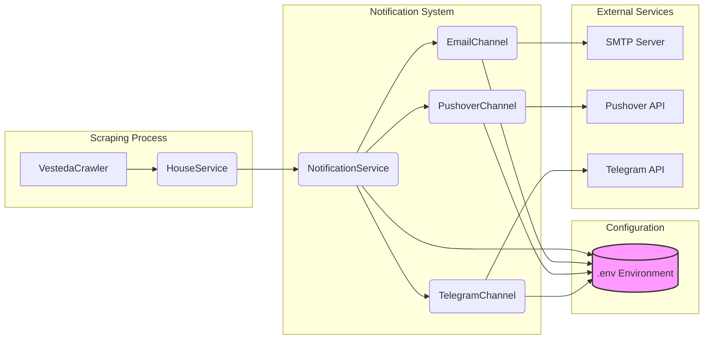

Oké, begrepen. We parkeren het plan voor de generieke structuur en focussen ons eerst op het implementeren van het notificatiesysteem met de door jou aangeleverde scripts.

Hier is het implementatieplan specifiek voor de notificaties:

## Implementatieplan: Notificatiesysteem voor Nieuwe Woningen

**Doel:** Integreer de bestaande notificatiescripts (Email, Pushover, Telegram) in de `cursor_steal_house` applicatie, zodat een notificatie wordt verstuurd wanneer de scraper een nieuwe woning identificeert.

**Kernprincipes:**

1.  **Integratie:** Voeg de notificatielogica toe aan de bestaande scraping flow.
2.  **Modulariteit:** Structureer de notificatiecode zodat deze makkelijk te beheren en uit te breiden is.
3.  **Configuratie:** Maak het mogelijk om via configuratie (omgevingsvariabelen) te bepalen welke kanalen actief zijn en waar notificaties naartoe moeten.
4.  **Triggering:** Koppel het versturen van notificaties aan het moment dat een *nieuwe* woning wordt gedetecteerd in de `HouseService`.

---

### 1. Overzicht van de Architectuur

1.  **Notificatie Kanalen (`NotificationChannel`):** Abstracte basisklasse en concrete implementaties voor Email, Pushover en Telegram. Elk kanaal is verantwoordelijk voor het versturen van een bericht via zijn specifieke medium.
2.  **Notificatie Service (`NotificationService`):** Een centrale service die:
    *   Weet welke kanalen geconfigureerd en actief zijn.
    *   Een methode biedt om een notificatie over een nieuwe woning naar alle actieve kanalen te sturen.
    *   De benodigde configuratie (API keys, ontvanger details) laadt.
3.  **Integratiepunt (`HouseService`):** De `HouseService` wordt aangepast om de `NotificationService` aan te roepen wanneer nieuwe woningen worden geïdentificeerd tijdens het opslagproces.
4.  **Configuratie (`.env`):** Omgevingsvariabelen bepalen welke kanalen actief zijn en bevatten de nodige credentials en ontvanger-informatie.



---

### 2. Databaseontwerp

Voor deze specifieke implementatie zijn **geen** database-aanpassingen nodig. De configuratie wordt volledig via omgevingsvariabelen beheerd.

---

### 3. Architectuurplan voor de Notificatieklassen

**Nieuwe Directory Structuur:**

```
crawler_job/
├── notifications/
│   ├── __init__.py
│   ├── channels/
│   │   ├── __init__.py
│   │   ├── base.py         # AbstractNotificationChannel
│   │   ├── email.py        # EmailNotificationChannel
│   │   ├── pushover.py     # PushoverNotificationChannel
│   │   └── telegram.py     # TelegramNotificationChannel
│   └── notification_service.py # NotificationService
├── services/
│   └── house_service.py    # Aanpassen voor integratie
└── crawlers/
    └── vesteda/
        └── vesteda_crawler.py # Aanpassen voor initialisatie
```

**Klasse Beschrijvingen:**

1.  **`AbstractNotificationChannel` (`crawler_job/notifications/channels/base.py`):**
    *   **Verantwoordelijkheid:** Definieert de interface voor alle notificatiekanalen.
    *   **Methoden:**
        *   `__init__(self)`
        *   `async send_notification(self, subject: str, message: str) -> bool`: Abstracte methode. Verstuurt de notificatie. Retourneert `True` bij succes, `False` bij falen.

2.  **`EmailNotificationChannel` (`crawler_job/notifications/channels/email.py`):**
    *   **Erft van:** `AbstractNotificationChannel`.
    *   **Verantwoordelijkheid:** Verstuurt notificaties via e-mail.
    *   **Logica:** Verplaats de logica uit `email_notification.py` hierheen. Gebruik `pydantic-settings` voor SMTP-configuratie.
    *   **Attributen:** `settings: EmailSettings`, `recipient_email: str`.
    *   **Methoden:**
        *   `__init__(self, recipient_email: str)`: Laadt `EmailSettings` en slaat `recipient_email` op.
        *   `async send_notification(self, subject: str, message: str) -> bool`: Implementeert de e-mail verzendlogica. Gebruik `asyncio.to_thread` om de synchrone `smtplib` code in een async context uit te voeren.

3.  **`PushoverNotificationChannel` (`crawler_job/notifications/channels/pushover.py`):**
    *   **Erft van:** `AbstractNotificationChannel`.
    *   **Verantwoordelijkheid:** Verstuurt notificaties via Pushover.
    *   **Logica:** Verplaats de logica uit `pushover_notification.py` hierheen. Gebruik `pydantic-settings` voor Pushover-configuratie.
    *   **Attributen:** `settings: PushoverSettings`.
    *   **Methoden:**
        *   `__init__(self)`: Laadt `PushoverSettings`.
        *   `async send_notification(self, subject: str, message: str) -> bool`: Implementeert de Pushover API call. Gebruik `httpx` (async http client) of `asyncio.to_thread` voor `requests`.

4.  **`TelegramNotificationChannel` (`crawler_job/notifications/channels/telegram.py`):**
    *   **Erft van:** `AbstractNotificationChannel`.
    *   **Verantwoordelijkheid:** Verstuurt notificaties via Telegram.
    *   **Logica:** Verplaats de logica uit `telegram_notification.py` hierheen. Gebruik `pydantic-settings` voor Telegram-configuratie.
    *   **Attributen:** `settings: TelegramSettings`.
    *   **Methoden:**
        *   `__init__(self)`: Laadt `TelegramSettings`.
        *   `async send_notification(self, subject: str, message: str) -> bool`: Implementeert de Telegram `send_message` call. De `python-telegram-bot` library ondersteunt `asyncio`.

5.  **`NotificationService` (`crawler_job/notifications/notification_service.py`):**
    *   **Verantwoordelijkheid:** Beheert de actieve notificatiekanalen en orkestreert het versturen van notificaties.
    *   **Attributen:** `active_channels: List[AbstractNotificationChannel]`.
    *   **Methoden:**
        *   `__init__(self)`: Leest omgevingsvariabelen (`NOTIFICATION_CHANNELS_ACTIVE`, `NOTIFICATION_RECIPIENT_EMAIL`, etc.) en initialiseert de overeenkomstige actieve kanalen.
        *   `async send_new_house_notification(self, house: GalleryHouse)`: Formatteert een bericht op basis van de `GalleryHouse` data (bv. adres, stad, detail URL) en roept `send_notification` aan op elk actief kanaal. Logt successen en fouten per kanaal.

---

### 4. Extensibiliteitsplan

*   **Nieuw Kanaal Toevoegen:**
    1.  Creëer een nieuwe klasse (bv. `SmsNotificationChannel`) die erft van `AbstractNotificationChannel`.
    2.  Implementeer de `__init__` (voor configuratie) en `async send_notification` methoden.
    3.  Voeg de nodige configuratievariabelen toe aan `.env`.
    4.  Pas de `NotificationService.__init__` aan om het nieuwe kanaal te initialiseren als het is geactiveerd via `NOTIFICATION_CHANNELS_ACTIVE`.

---

### 5. Stappenplan voor Implementatie

1.  **Dependencies Toevoegen:**
    *   Voeg `python-telegram-bot`, `requests` (of liever `httpx` voor async), en `pydantic-settings` toe aan `requirements.txt`.
    *   Installeer de nieuwe dependencies: `pip install -r requirements.txt`.
2.  **Directory Structuur:**
    *   Maak de `crawler_job/notifications/` en `crawler_job/notifications/channels/` directories aan.
3.  **Abstracte Klasse:**
    *   Implementeer `AbstractNotificationChannel` in `base.py`.
4.  **Concrete Kanalen:**
    *   Implementeer `EmailNotificationChannel`, `PushoverNotificationChannel`, `TelegramNotificationChannel` in hun respectievelijke bestanden in de `channels/` map. Verplaats de logica uit de oorspronkelijke scripts. Zorg voor correcte configuratie-lading met `pydantic-settings` en maak de `send_notification` methoden `async`.
5.  **Notificatie Service:**
    *   Implementeer `NotificationService` in `notification_service.py`.
    *   Implementeer de `__init__` om actieve kanalen te laden op basis van `NOTIFICATION_CHANNELS_ACTIVE`.
    *   Implementeer `send_new_house_notification` om een bericht te formatteren en te versturen via de actieve kanalen. Zorg voor foutafhandeling per kanaal (log errors, maar laat de service niet crashen).
6.  **Integratie in `HouseService`:**
    *   Pas `HouseService.__init__` aan om een `NotificationService` instantie te accepteren: `def __init__(self, notification_service: Optional[NotificationService] = None):`.
    *   In `HouseService.store_houses_atomic` (of de helper `_store_gallery_houses_with_repos`), na het identificeren van `new_houses` (de lijst van Pydantic `GalleryHouse` objecten):
        ```python
        # Inside store_houses_atomic or _store_gallery_houses_with_repos
        new_pydantic_houses, existing_pydantic_houses = await self._store_gallery_houses_with_repos(...) # Assuming this returns Pydantic models

        if self.notification_service and new_pydantic_houses:
            for house in new_pydantic_houses:
                try:
                    await self.notification_service.send_new_house_notification(house)
                except Exception as e:
                    logger.error(f"Failed to send notification for {house.address}: {e}", exc_info=True)
        ```
7.  **Initialisatie in Hoofdscript:**
    *   Pas `crawler_job/crawlers/vesteda/vesteda_crawler.py` (of het hoofd entry point) aan:
        *   Importeer `NotificationService`.
        *   Initialiseer `notification_service = NotificationService()`.
        *   Geef deze instantie mee bij het initialiseren van `HouseService`: `async with HouseService(notification_service=notification_service) as house_service:`.
8.  **Configuratie (`.env`):**
    *   Voeg de volgende variabelen toe aan `.env` (en `.env.prod`):
        ```dotenv
        # Notification Settings
        NOTIFICATION_CHANNELS_ACTIVE=email,pushover,telegram # Comma-separated list of active channels (lowercase)
        NOTIFICATION_RECIPIENT_EMAIL=jouw_email@example.com # Target email for notifications

        # Existing variables needed by channels
        SMTP_SERVER=smtp.gmail.com
        SMTP_PORT=587
        EMAIL_USER=jouw_gmail_username@gmail.com
        EMAIL_PASSWORD=jouw_gmail_app_password # Use App Password for Gmail

        PUSHOVER_TOKEN=jouw_pushover_app_token
        PUSHOVER_USER_KEY=jouw_pushover_user_key

        TELEGRAM_BOT_TOKEN=jouw_telegram_bot_token
        TELEGRAM_CHAT_ID=jouw_telegram_chat_id
        ```
    *   **Belangrijk:** Zorg ervoor dat de credentials veilig worden beheerd (bv. via `.env` lokaal, Secret Manager in de cloud). Voeg `.env` toe aan `.gitignore`.
9.  **Testen:**
    *   Unit tests voor elk notificatiekanaal (mock de externe API calls).
    *   Unit tests voor `NotificationService` (mock de kanalen).
    *   Integratietest: Voer een scrape uit en zorg ervoor dat er een nieuwe woning wordt gevonden. Verifieer dat de geconfigureerde notificaties worden verstuurd en correct aankomen. Test ook het geval waarbij geen nieuwe woningen worden gevonden. Test foutafhandeling (bv. ongeldige API key).
10. **Documentatie:**
    *   Update `README.md` met instructies voor het configureren van notificaties via `.env`.

---

### 6. Potentiële Uitdagingen en Aanpak

1.  **API Rate Limits:**
    *   **Uitdaging:** Externe services (Pushover, Telegram) kunnen rate limits hebben.
    *   **Aanpak:** Implementeer (indien nodig later) een wachtrij of backoff-mechanisme in de `NotificationService` als er veel notificaties tegelijk verstuurd moeten worden. Voor nu is dit waarschijnlijk geen probleem.
2.  **Foutafhandeling:**
    *   **Uitdaging:** Een falend kanaal mag de scraping niet stoppen.
    *   **Aanpak:** De `NotificationService` moet exceptions per kanaal afvangen en loggen, maar doorgaan met andere kanalen en de `HouseService` niet blokkeren.
3.  **Credentials Management:**
    *   **Uitdaging:** API keys en wachtwoorden veilig houden.
    *   **Aanpak:** Gebruik `.env` lokaal en overweeg Google Secret Manager of vergelijkbare oplossingen voor productie-deployments in de cloud.
4.  **Asynchrone Implementatie:**
    *   **Uitdaging:** Sommige libraries (zoals `smtplib`) zijn synchroon.
    *   **Aanpak:** Gebruik `asyncio.to_thread` om synchrone code in een aparte thread uit te voeren binnen de async event loop, of zoek naar async alternatieven (bv. `aiohttp` of `httpx` voor Pushover, `aiosmtplib` voor email). `python-telegram-bot` heeft al goede async ondersteuning.
5.  **Bericht Formattering:**
    *   **Uitdaging:** Een duidelijk en informatief bericht maken.
    *   **Aanpak:** In `NotificationService.send_new_house_notification`, formatteer een bericht met essentiële info zoals adres, stad, prijs (indien beschikbaar in `GalleryHouse`), en een directe link naar `house.detail_url`.

---

Dit plan zorgt voor een modulaire en configureerbare integratie van het notificatiesysteem in de bestaande applicatie, direct getriggerd door de detectie van nieuwe woningen.