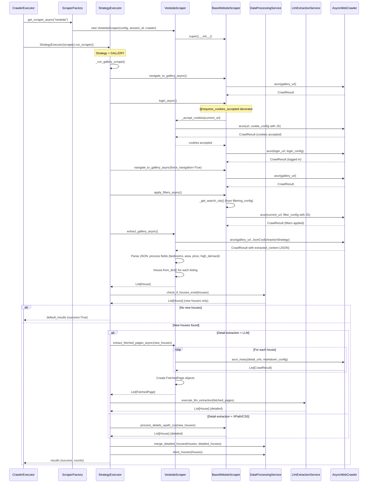

# Vesteda Scraper Sequence Diagram

```mermaid
sequenceDiagram
    participant Executor as CrawlerExecutor
    participant Factory as ScraperFactory
    participant Strategy as StrategyExecutor
    participant Vesteda as VestedaScraper
    participant Base as BaseWebsiteScraper
    participant DataService as DataProcessingService
    participant LLMService as LlmExtractionService
    participant Crawler as AsyncWebCrawler

    Executor->>Factory: get_scraper_async("vesteda")
    Factory->>Vesteda: new VestedaScraper(config, session_id, crawler)
    Vesteda->>Base: super().__init__()
    
    Executor->>Strategy: StrategyExecutor(scraper).run_scraper()
    
    Note over Strategy: Strategy = GALLERY
    
    Strategy->>Strategy: _run_gallery_scrape()
    
    Strategy->>Base: navigate_to_gallery_async()
    Base->>Crawler: arun(gallery_url)
    Crawler-->>Base: CrawlResult
    
    Strategy->>Base: login_async()
    Note over Base: @requires_cookies_accepted decorator
    Base->>Vesteda: _accept_cookies(current_url)
    Vesteda->>Crawler: arun(url, cookie_config with JS)
    Crawler-->>Vesteda: CrawlResult (cookies accepted)
    Vesteda-->>Base: cookies accepted
    Base->>Crawler: arun(login_url, login_config)
    Crawler-->>Base: CrawlResult (logged in)
    
    Strategy->>Base: navigate_to_gallery_async(force_navigation=True)
    Base->>Crawler: arun(gallery_url)
    Crawler-->>Base: CrawlResult
    
    Strategy->>Base: apply_filters_async()
    Base->>Base: _get_search_city() (from filtering_config)
    Base->>Crawler: arun(current_url, filter_config with JS)
    Crawler-->>Base: CrawlResult (filters applied)
    
    Strategy->>Vesteda: extract_gallery_async()
    Vesteda->>Crawler: arun(gallery_url, JsonCssExtractionStrategy)
    Crawler-->>Vesteda: CrawlResult with extracted_content (JSON)
    Vesteda->>Vesteda: Parse JSON, process fields (bedrooms, area, price, high_demand)
    Vesteda->>Vesteda: House.from_dict() for each listing
    Vesteda-->>Strategy: List[House]
    
    Strategy->>DataService: check_if_houses_exist(houses)
    DataService-->>Strategy: List[House] (new houses only)
    
    alt No new houses
        Strategy-->>Executor: default_results (success=True)
    else New houses found
        alt Detail extraction = LLM
            Strategy->>Vesteda: extract_fetched_pages_async(new_houses)
            loop For each house
                Vesteda->>Crawler: arun_many(detail_urls, markdown_config)
                Crawler-->>Vesteda: List[CrawlResult]
            end
            Vesteda->>Vesteda: Create FetchedPage objects
            Vesteda-->>Strategy: List[FetchedPage]
            
            Strategy->>LLMService: execute_llm_extraction(fetched_pages)
            LLMService-->>Strategy: List[House] (detailed)
        else Detail extraction = XPath/CSS
            Strategy->>Base: process_details_xpath_css(new_houses)
            Base-->>Strategy: List[House] (detailed)
        end
        
        Strategy->>DataService: merge_detailed_houses(houses, detailed_houses)
        Strategy->>DataService: store_houses(houses)
        
        Strategy-->>Executor: results (success, counts)
    end
```
